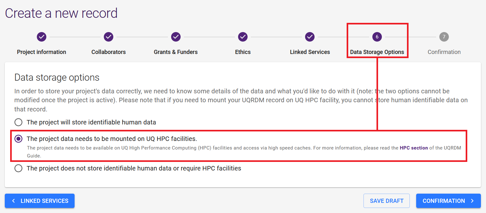
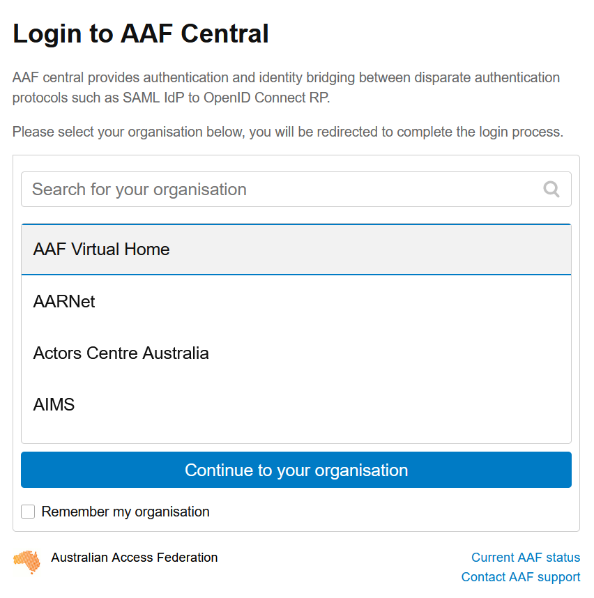
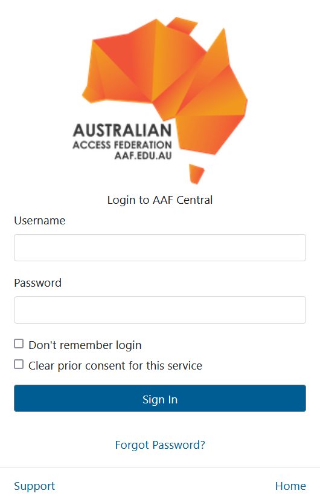

import { Tabs, TabItem, Steps } from '@astrojs/starlight/components';
import EmailRequestForm from '@components/EmailRequestForm.astro';
import EmailAafRequestForm from '@components/EmailAafRequestForm.astro';
import SignInAaf from '@partials/sign-in-aaf.mdx';
import AccessingProject from '@partials/accessing-project.mdx';
import TabQueryLink from '@components/TabQueryLink.astro';
import MemberChooser from '@components/MemberChooser.astro';

<TabQueryLink />

Choose the option that matches your organisation — your selection is remembered as you move through the docs.

<MemberChooser />

<Tabs syncKey="member-type">

<TabItem label="UQ members">

For UQ staff and students.

## Signing into XNAT

<SignInAaf />

## Creating an XNAT project

For UQ users, XNAT uses UQ-RDM HPC collections for storage allocation. For any general questions about UQ-RDM, please refer to the [library guides](https://guides.library.uq.edu.au/for-researchers/uq-research-data-manager).

:::caution[Note]
Only one member of the project team needs to request for the project
:::

<Steps>

1. Before creating an XNAT project, you'll require a UQ-RDM **HPC Collection**

   - **HPC collections** end with **-Q** and a 4-digit numerical identifier (e.g. PROJ001-**Q0189**)
   - **Non-HPC collections** end with **-A** (e.g. PROJ001-**A0189**) or **-I** (PROJ001-**I0189**)

   Open [https://rdm.uq.edu.au/create-record](https://rdm.uq.edu.au/create-record), sign in and fill in the record as per your project details

   

   :::caution[Important]
   For **(6) Data Storage Options**, select the second option (_The project data needs to be mounted on UQ HPC facilities._). Any other option will be incompatible with XNAT, requiring a new RDM request.
   :::

   **REQUEST DATA STORAGE** when complete. You should have an RDM collection name ready (e.g. **PROJ001-Q0189**)

2. Open a ticket with RCC support. Fill in your RDM collection name below and click to send a pre-filled email.

   <EmailRequestForm />

3. The support ticket will inform you when the project is set up. XNAT project setup typically takes around ~24 hours from ticket submission.

</Steps>

</TabItem>

<TabItem label="Other AAF members">

For users from Australian universities and AAF member organisations (QUT, Griffith, CQU, JCU, USQ, USC, CSIRO and others). Full list of AAF members found [here](https://aaf.edu.au/subscribers).

## Signing into XNAT

<SignInAaf />

## Accessing your XNAT project

<AccessingProject />

</TabItem>

<TabItem label="Non-AAF members">

For users from non-AAF organisations (QLD Health, TRI, QIMR, QLD Xray). QCIF/QRIScloud can provide an AAF Virtual Home (VHO) account for login.

## Request an AAF VHO account

<Steps>

1. Open a ticket with RCC support to request an AAF account. Fill in your details below and click to send a pre-filled email.

   <EmailAafRequestForm />

2. AAF's VHO service will return an email regarding the account registration process.

</Steps>

## Signing into XNAT

<Steps>

1. Open [https://xnat.rcc.uq.edu.au](https://xnat.rcc.uq.edu.au) and log in with the AAF Single sign-on button.

   

2. Select the **AAF Virtual Home** option and login with your AAF VHO credentials.

   

   

3. After the AAF sign-in, you should be redirected back to XNAT. There will be **no projects listed** the first time.

   

</Steps>

## Accessing your XNAT project

<AccessingProject />

</TabItem>

</Tabs>

:::note
Data acquired at HIRF, CAI or TRI can be sent to the UQ AIS XNAT repository. If you have multiple valid affiliations, we'd recommend using UQ or AAF where possible. Questions: contact rcc-support@uq.edu.au or HIRFAdministration@health.qld.gov.au
:::
