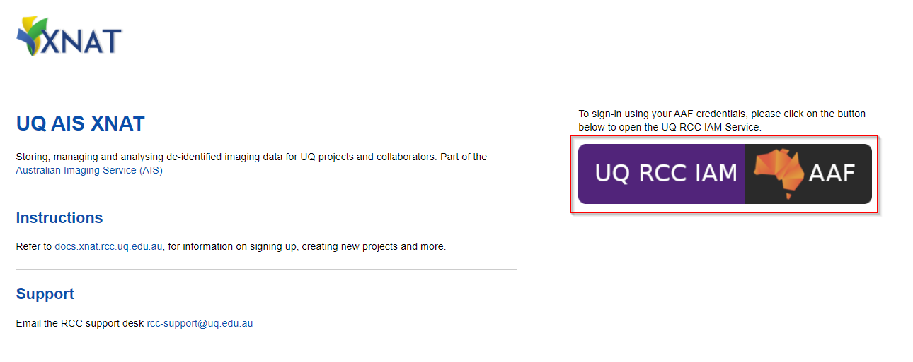
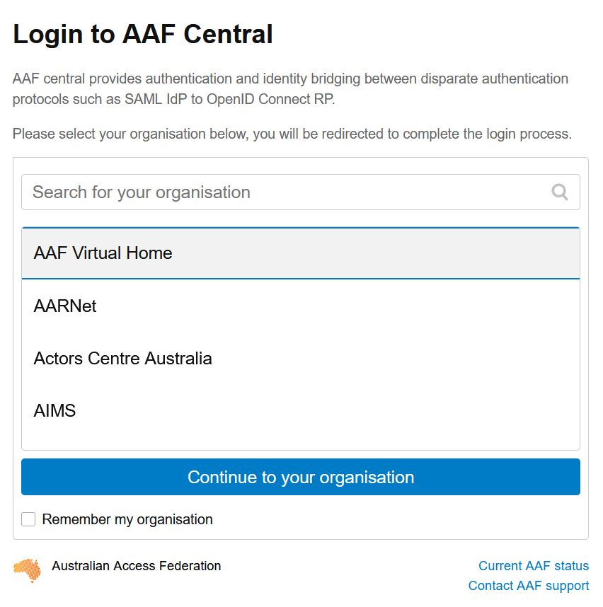
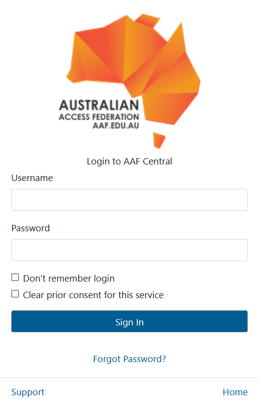
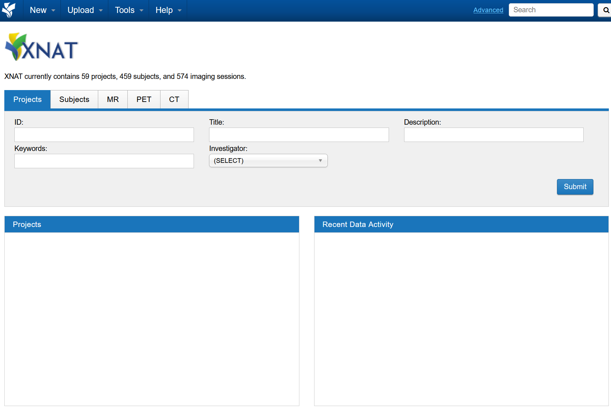

import { Tabs, TabItem, Steps, LinkCard } from '@astrojs/starlight/components';
import ChoiceCards from '@components/ChoiceCards.astro';
import RequestEmailForm from '@components/RequestEmailForm.astro';
import SignInAaf from '@partials/sign-in-aaf.mdx';
import TabQueryLink from '@components/TabQueryLink.astro';

<TabQueryLink />

Logging in to XNAT uses the Australian Access Federation (AAF). How you start
depends on whether your organisation is an AAF member.

<ChoiceCards
  label="Choose your organisation type"
  options={[
    {
      tab: 'AAF members',
      who: 'UQ, QUT, Griffith, CQU, JCU, USQ, USC, Bond, CSIRO, QCIF and other AAF members',
    },
    {
      tab: 'Non-AAF members',
      who: 'TRI, QIMR, QLD Health, QLD Xray, Pacific Radiology',
    },
  ]}
/>

<Tabs syncKey="member-type">

<TabItem label="AAF members">

If your organisation is part of the AAF, you already have everything you need to
log in. The [full list of AAF members](https://aaf.edu.au/subscribers) is on the
AAF site.

## Logging into XNAT

<SignInAaf />

## Your XNAT project

<LinkCard
  title="Your XNAT project"
  href="/user-guides/using-xnat/projects/your-project"
  description="Request a new project, join an existing one, or find data acquired at a facility."
/>

</TabItem>

<TabItem label="Non-AAF members">

If your organisation is not an AAF member, QCIF and QRIScloud can provide an AAF
Virtual Home (VHO) account so you can log in. Request that first.

## Request an AAF VHO account

<Steps>

1. Open a ticket with RCC support. Fill in your details below, then copy the
   generated email into your mail client.

   <RequestEmailForm
     fields={[
       { id: 'project', label: 'XNAT Project Name', placeholder: 'e.g. MyProject' },
       { id: 'org', label: 'Organisation', placeholder: 'e.g. QLD Health' },
       { id: 'site', label: 'Data Acquisition Site', placeholder: 'e.g. HIRF, CAI, TRI' },
     ]}
     subject="XNAT AAF account for project {project}"
     body={"Hello RCC support,\n\nI require an AAF account to access the UQ XNAT service.\n\nMy details are below:\nOrganisation: {org}\nData Acquisition Site: {site}\n\nThank you"}
   />

2. AAF's VHO service will email you about the account registration process.

</Steps>

## Logging into XNAT

<Steps>

1. Open [https://xnat.rcc.uq.edu.au](https://xnat.rcc.uq.edu.au) and log in with
   the AAF Single sign-on button.

   

2. Select the **AAF Virtual Home** option and log in with your VHO credentials.

   

   

3. After the AAF sign-in you are redirected back to XNAT. There will be **no
   projects listed** the first time.

   

</Steps>

## Your XNAT project

<LinkCard
  title="Your XNAT project"
  href="/user-guides/using-xnat/projects/your-project"
  description="Join an existing project, or find data acquired at a facility."
/>

</TabItem>

</Tabs>

:::note
Data acquired at HIRF, CAI or TRI can be sent to the UQ XNAT repository. If you
have multiple valid affiliations, we recommend using UQ or AAF where possible.
:::
