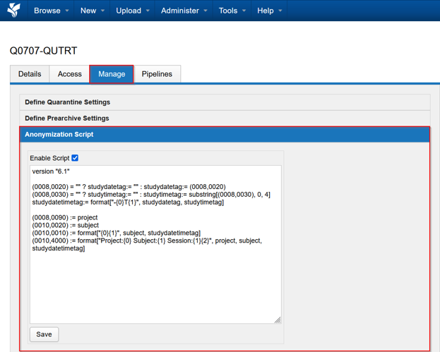
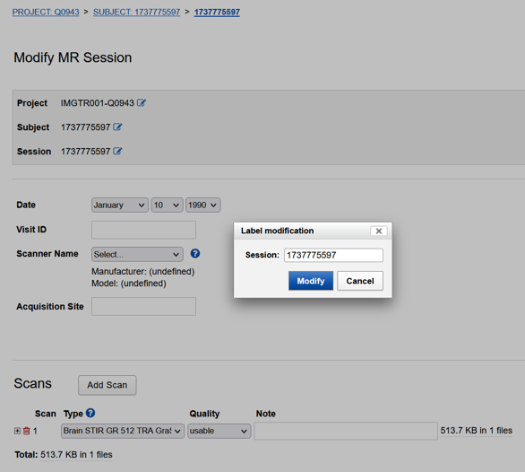

The Project level anonymiser uses a scripting syntax called DicomEdit to modify, reassign or blank DICOM tags.
You can actually use this to create automated workflow for renaming DICOM metadata on datasets

Dicomedit
: https://wiki.xnat.org/xnat-tools/dicomedit/dicomedit-6-3-language-reference
```python
version "6.1"
project != "Unassigned" ? (0008,1030) := project
(0010,0010) := subject
(0010,0020) := session
```

The example in this screenshot basically replicates the behaviour in the HIRF onsite anonymiser for remapping the ReferringPhysicianName, PatientName and PatientID



You can use DICOMedit to enforce a particular naming and tagging scheme across your entire project this way.

## Anonymising existing sesssions

:::note[Note]
If you’re planning to use the project level anonymiser, best solution would be to have your project’s renaming, retagging or anonymisation scheme established before starting data acquisition.
:::

The Project level anonymiser works best for new sessions, as it runs when the dataset is being ingested into the XNAT archive, or when sessions are renamed. By default, it does not anonymise sessions that are sitting in the archive already.

If you need to trigger your anonymisation on an existing session
- Edit a session name. Modify
- Then edit it back to its original name

This will trigger the anonymisation script.

:::caution[Warning]
Session edits take a bit of time, as the files and metadata are modified during edits, so allow some wait time if you use this method.
:::


