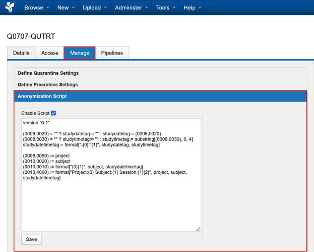
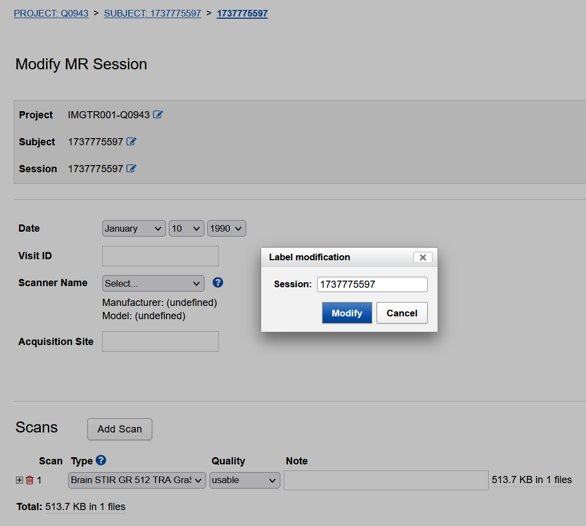

import { CardGrid, LinkCard } from '@astrojs/starlight/components';

Use a project-level anonymiser to modify, replace or blank DICOM tags as sessions enter your project. XNAT runs the rules as a DicomEdit script, so you can enforce a consistent naming and tagging scheme across the project.

See the [DicomEdit language reference](https://wiki.xnat.org/xnat-tools/dicomedit/dicomedit-6-3-language-reference) for the available syntax and operations.

## Configure the script

The following example sets the study description to the project ID, the patient name to the subject ID and the patient ID to the session ID:

```text
version "6.1"
project != "Unassigned" ? (0008,1030) := project
(0010,0010) := subject
(0010,0020) := session
```

The XNAT interface lets a project Owner enable, edit and save the script for the project.



Configure and test your project's renaming, retagging and anonymisation rules before data acquisition begins whenever possible.

## Apply the script to an existing session

The project anonymiser runs when a dataset enters the XNAT archive or when a session is renamed. It does not automatically revisit sessions already in the archive.

To trigger the script for an existing session:

1. Edit the session label and save the change.
2. Change the session label back to its original value and save it again.

XNAT updates the files and metadata during each edit, so allow time for both changes to finish.



## Next steps

<CardGrid>
  <LinkCard title="On-site anonymisation" href="/user-guides/managing-data/anonymising-data/site-anonymiser" description="Review the DICOM tags modified before facility data reaches XNAT." />
  <LinkCard title="Syncing between XNATs" href="/user-guides/managing-data/syncing-data" description="Configure XSync and apply anonymisation as data is sent to another XNAT." />
</CardGrid>
