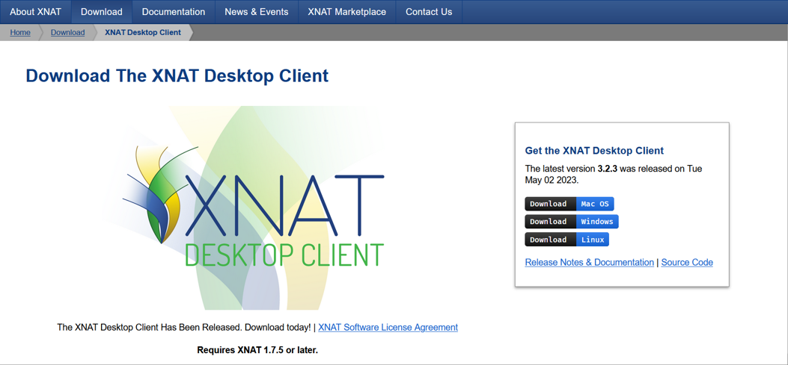
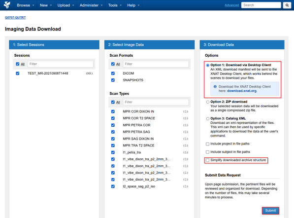
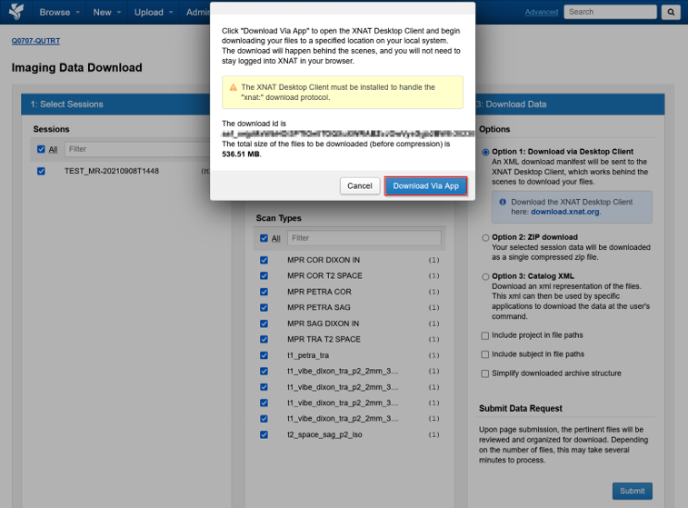
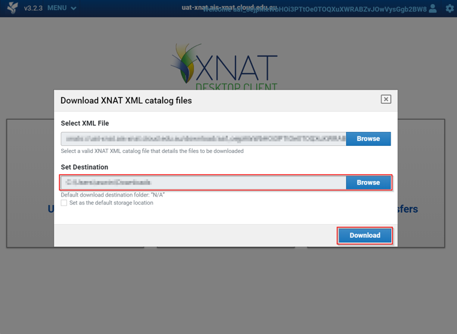
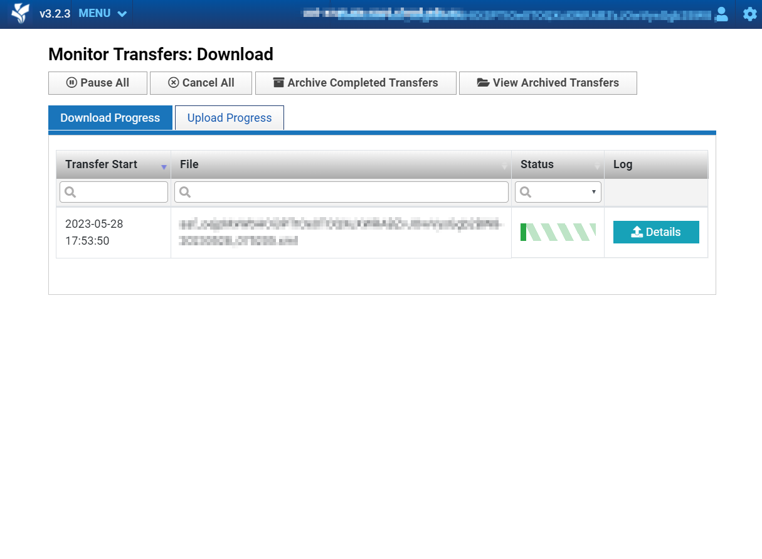

The XNAT Desktop client is maintained by the XNAT development team. For information see the link below.

XNAT Desktop client
: https://www.xnat.org/download/desktop-client/

## Install client

Download and install the client for you operating system

## Download images

The Project, Subject and Sessions page has the option to **Download Images** from the right hand side menu

Select **Option 1: Download via Desktop Client**

:::caution[Note]
Untick **Simply downloaded archive structure** to keep scan names in scan folders
:::

Click **Download Via App**

Select a local destination folder

Download should start, and progress can be monitored
