import { Tabs, TabItem, Steps } from '@astrojs/starlight/components';
import TabQueryLink from '@components/TabQueryLink.astro';

There are three ways to get data out of XNAT. Which one you want depends on how
much you are taking and what you plan to do with it.

| If you want | Use | Notes |
| --- | --- | --- |
| A whole project, subject or session | **Zip download** | Everything in one archive, straight from the browser |
| Large downloads, or a resumable transfer | **Desktop client** | A separate application you install once |
| One scan, or a few scans from a session | **Individual scans** | Fastest when you only need part of a session |

{/* Tab labels are load-bearing: TabQueryLink slugifies the label to build the
    ?method= value, and the legacy redirects in astro.config.mjs point at those
    exact slugs. Renaming a label breaks those URLs silently. */}

<Tabs syncKey="download-method">
<TabItem label="Zip download">

The Project, Subject and Sessions pages each have a **Download Images** option
in the right hand side menu.

<Steps>

1. Open **Download Images** from the right hand menu.

   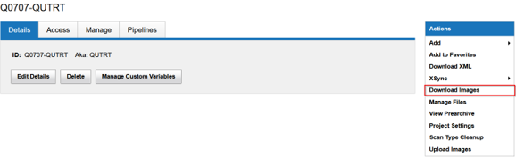

2. Choose what to include from the download options.

   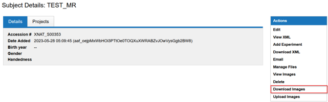

3. Select **Option 2: ZIP download**.

   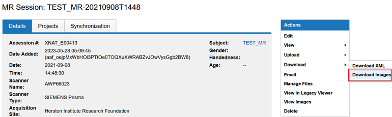

   :::caution
   Untick **Simply downloaded archive structure** to keep scan names in scan folders.
   :::

4. Filter the sessions and scans using the first two columns, then select **Submit**.

   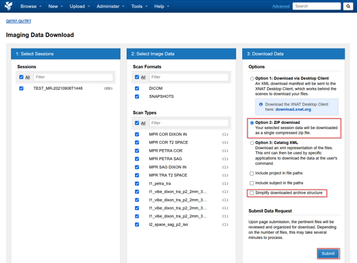

</Steps>

</TabItem>
<TabItem label="Desktop client">

The XNAT Desktop client is a separate application maintained by the XNAT
development team. Install it once, then trigger downloads from the browser and
hand them to the client.

<Steps>

1. Download and install [the XNAT Desktop client](https://www.xnat.org/download/desktop-client/)
   for your operating system.

   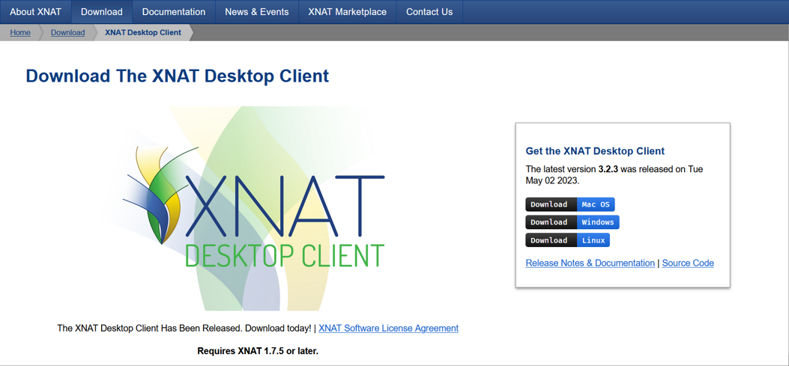

2. In XNAT, open **Download Images** from the right hand menu of a Project,
   Subject or Session.

   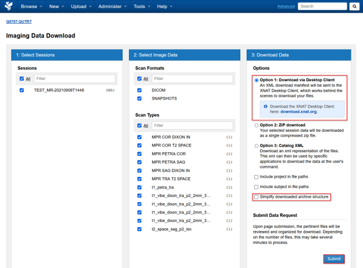

3. Select **Option 1: Download via Desktop Client**.

   :::caution
   Untick **Simply downloaded archive structure** to keep scan names in scan folders.
   :::

   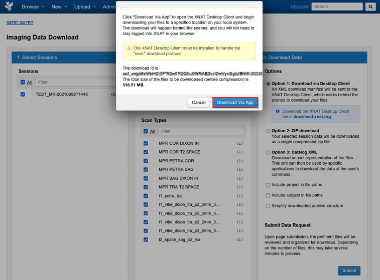

4. Click **Download Via App**.

   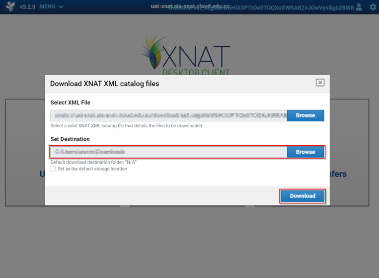

5. Select a local destination folder. The download starts, and you can monitor
   its progress in the client.

   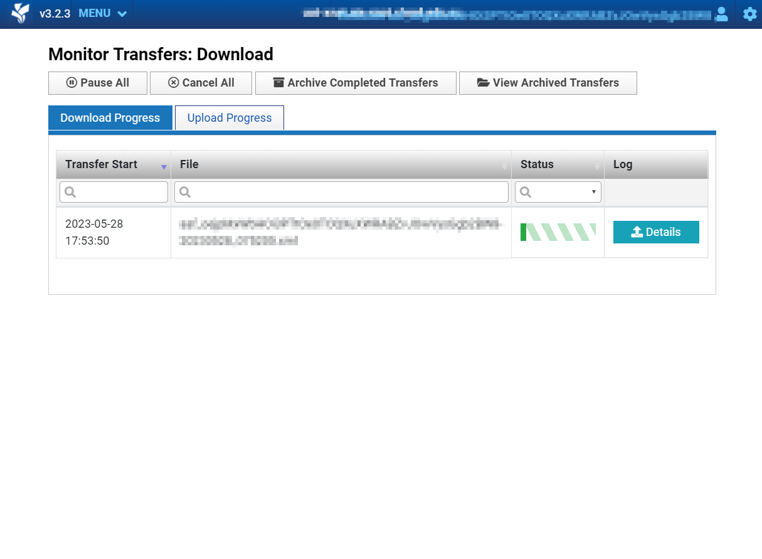

</Steps>

</TabItem>
<TabItem label="Individual scans">

When you only need part of a session, download the scans directly from the
Sessions page rather than taking the whole session.

<Steps>

1. Open the session and download the scan from the Sessions page.

   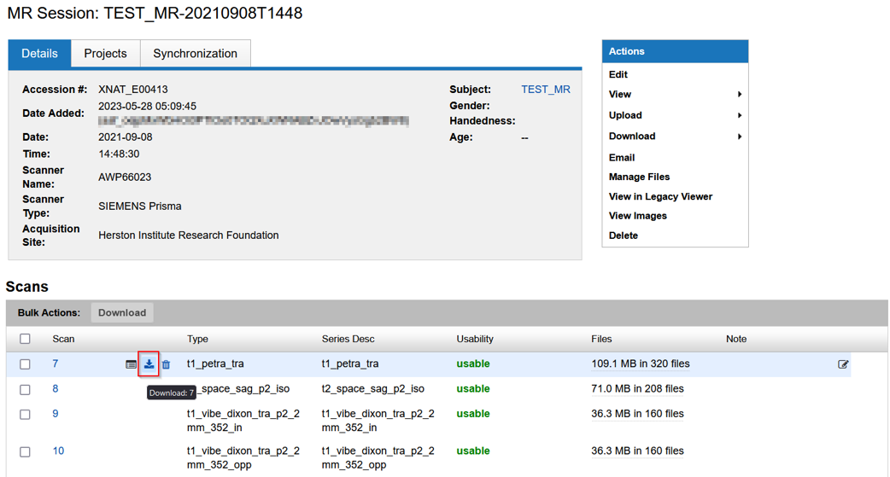

2. To take several at once, select the scans you want and use **Bulk Actions**.

   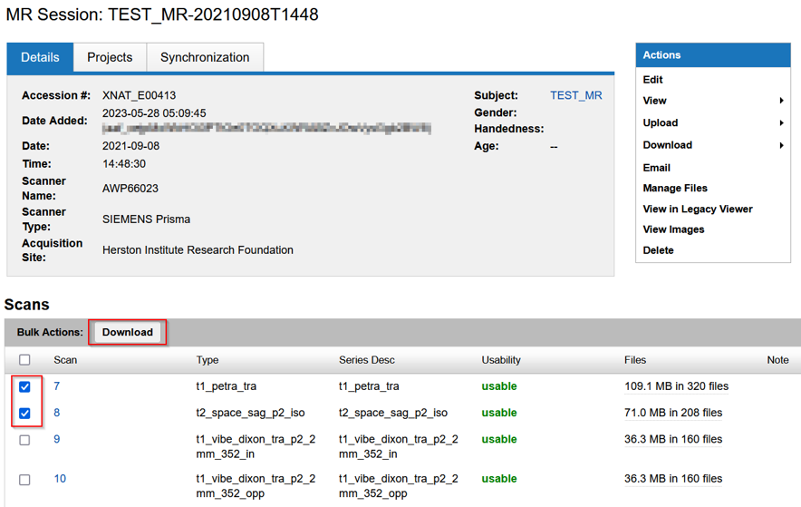

</Steps>

</TabItem>
</Tabs>

<TabQueryLink param="method" />

## Further reading

- [XNAT official guide on downloading image data](https://wiki.xnat.org/documentation/how-to-use-xnat/how-to-download-image-data-from-xnat-projects)
