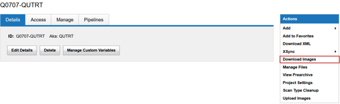
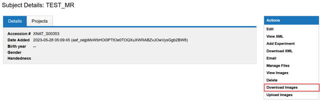
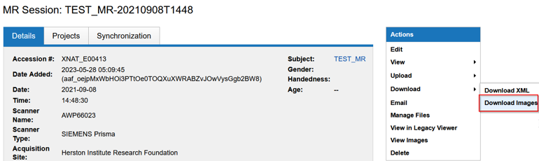
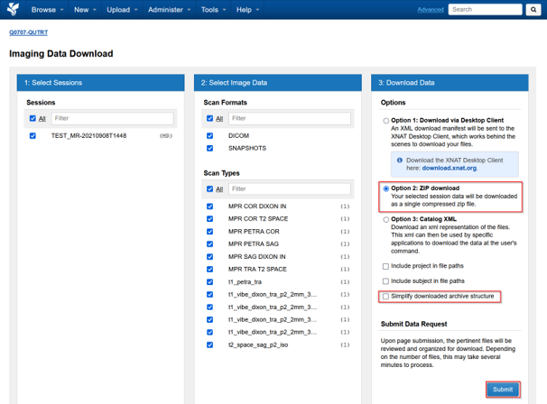

The Project, Subject and Sessions page has the option to **Download Images** from the right hand side menu

Select **Option 2: ZIP download**

:::caution[Note]
Untick **Simply downloaded archive structure** to keep scan names in scan folders
:::

Filter out the Session and scans from the first two columns and select **Submit**
