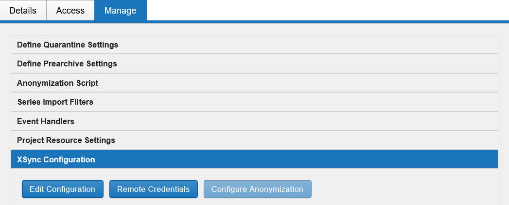
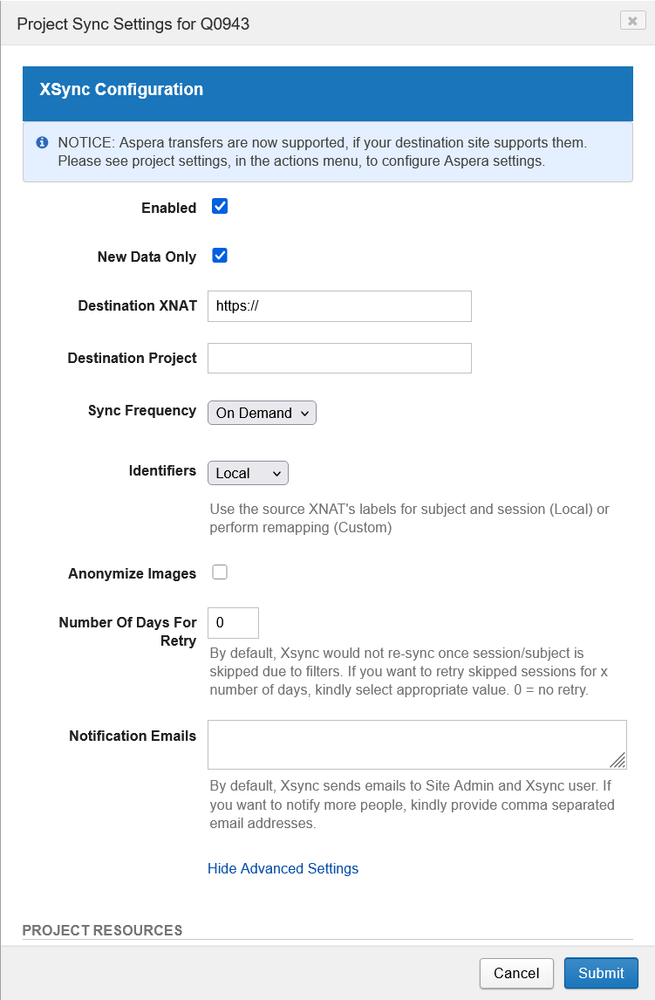

import { Steps, Aside } from '@astrojs/starlight/components';

XSync copies data from a project on this XNAT to a project on another XNAT. Once
it is configured, new sessions archived into the source project are transferred
automatically, so collaborators on the other site see your data without anyone
downloading and re-uploading it.

You configure XSync yourself from the project's **Manage** tab. You need to be an
**Owner** of the source project.

## Before you start

You need two things:

- **An account on the destination XNAT**, with member access to the destination
  project.
- **Owner access** to the project on this XNAT that data will be sent from.

<Aside type="caution" title="Check your de-identification first">
Data leaving this XNAT is subject to the same obligations as data entering it.
Confirm your ethics approval covers transfer to the destination site before you
enable a sync.
</Aside>

## Generate an alias token on the destination XNAT

XSync cannot use AAF to log in to the other site, so it authenticates with an
alias token instead.

<Steps>

1. Log in to the **destination** XNAT.

2. Create an alias token there, following [Alias tokens](/user-guides/processing-data/alias-tokens).

3. Copy the **alias** and the **secret**. The alias is the username and the
   secret is the password.

</Steps>

Alias tokens expire, so a sync will stop working when the token lapses. Note the
expiry date and generate a replacement before then.

## Open the XSync configuration

<Steps>

1. Open the source project on this XNAT and select the **Manage** tab.

2. Expand **XSync Configuration**.

   

</Steps>

Three buttons are available:

| Button | What it does |
| --- | --- |
| **Edit Configuration** | Sets the destination and the sync behaviour |
| **Remote Credentials** | Stores the alias token used to authenticate to the destination |
| **Configure Anonymization** | Edits the anonymisation script applied to data as it is sent |

## Store the remote credentials

Select **Remote Credentials** and enter the **alias** as the username and the
**secret** as the password, from the token you generated on the destination XNAT.

Do this before editing the configuration. Without valid credentials the sync has
no way to reach the other site.

## Edit the configuration

Select **Edit Configuration**. The project sync settings open in a dialog.

| Field | What to enter |
| --- | --- |
| **Enabled** | Turns syncing on for this project. |
| **New Data Only** | Sends only sessions archived from now on. Clear it to also transfer everything already in the project. |
| **Destination XNAT** | The full base URL of the other site, including `https://`. |
| **Destination Project** | The project ID on the destination XNAT. The project must already exist there. |
| **Sync Frequency** | How often the transfer runs. **On Demand** means nothing is sent until you trigger it. |
| **Identifiers** | **Local** keeps this site's subject and session labels. **Custom** remaps them on the destination. |
| **Anonymize Images** | Applies the anonymisation script from **Configure Anonymization** as data is sent. |
| **Number Of Days For Retry** | Sessions skipped by a filter are not retried by default. Set a number of days to retry them. `0` means no retry. |
| **Notification Emails** | Comma-separated addresses to notify in addition to the site administrator and the XSync user. |

Select **Submit** to save.

<Aside title="Identifiers">
Leave **Identifiers** on **Local** unless the destination project already uses a
different labelling scheme. Remapping is harder to reverse than to set up, and
mismatched labels between sites are difficult to reconcile later.
</Aside>

## Getting help

If the destination site is not reachable, or you are unsure whether syncing is
appropriate for your project, contact RCC support at `rcc-support@uq.edu.au` with
your project ID and the destination XNAT.

{/*
NEEDS CONFIRMING before this page is published:
- Which Sync Frequency options exist besides "On Demand".
- How an On Demand sync is triggered once configured (Actions menu item? button?).
- Whether the destination XNAT must whitelist this site, or whether valid remote
  credentials are sufficient.
- Whether "Configure Anonymization" is disabled until Enabled is submitted; it
  appears greyed out in the screenshot.
- Whether project Owners can reach the Manage tab's XSync section without RCC
  enabling anything first.
- Whether the Aspera notice in the dialog applies to any UQ destination.
*/}
