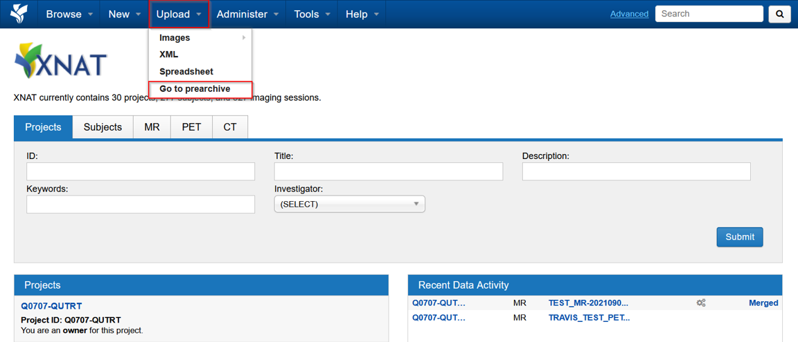
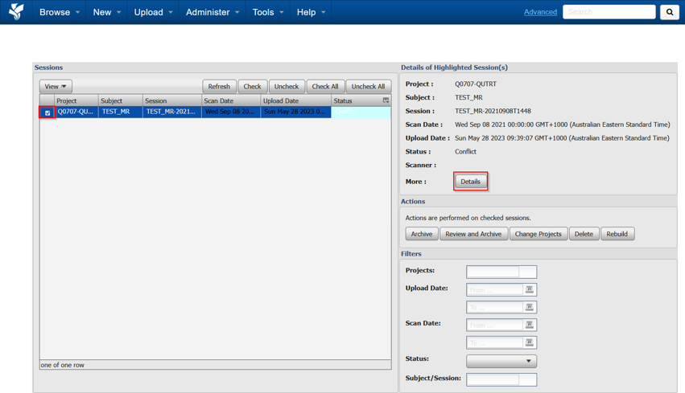
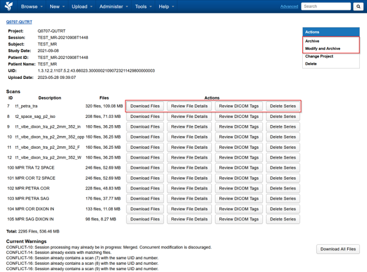

If a dataset has not arrived into your XNAT project, the prearchive would be the place to check

This usually happens when:
- a DICOM dataset matching an existing session gets resent
- a part of a session gets uploaded separately

## Accessing the prearchive

Go to **Upload** on the top menu, and **Go to prearchive**

The following is an example of a session that is in conflict. 
We can select the session and choose **Details**.

Here we can download the session, or individual scans. 
And review the datasets

- Choose **Archive** if you want the dataset merged into the existing one on the archive,
- choose **Modify and Archive** if any details need to be changed before archiving, or if you don’t want this dataset to merge with the existing one

