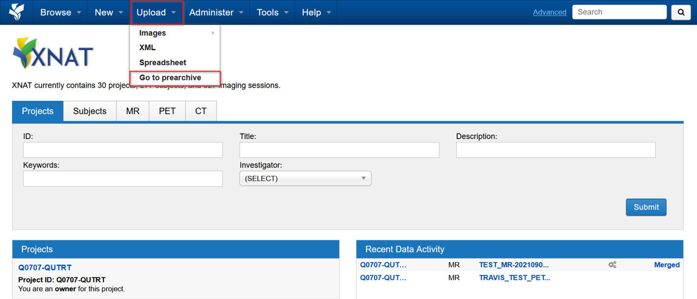
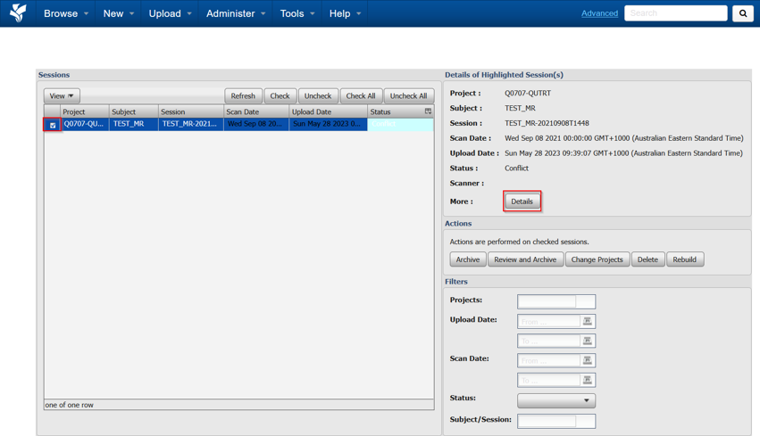
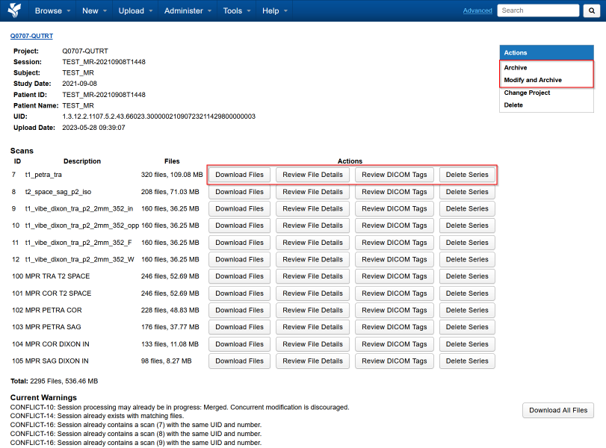

import { CardGrid, LinkCard } from '@astrojs/starlight/components';

If data you uploaded has not appeared in your XNAT project, it is probably
waiting in the **prearchive** — a holding area that uploads pass through before
they are archived into a project.

Data usually stops there when:

- a DICOM dataset matching an existing session is sent again
- part of a session is uploaded separately

## Finding your data

Go to **Upload** on the top menu, then **Go to prearchive**.

Select the session and choose **Details** to review it. Below is an example of a
session in conflict.

From here you can download the session or individual scans to check the contents
before deciding what to do with it.

## Archiving the data

This choice matters, and it cannot be undone easily:

- **Archive** merges the data into the existing session in your project. Use this
  when the upload is the missing part of a session that is already there.
- **Modify and Archive** lets you change the details first. Use this when the
  data should become a separate session, or when the session or subject labels
  are wrong.

:::caution
If you are not sure whether the data belongs to the existing session, download
it and check before archiving. Merging the wrong data into a session is harder
to unpick than archiving it separately.
:::

## Next steps

<CardGrid>
  <LinkCard title="Upload from the browser" href="/user-guides/managing-data/uploading-data/web-upload" description="Prepare a de-identified DICOM archive and send it to the prearchive." />
  <LinkCard title="Get support" href="/support" description="Contact RCC if you cannot resolve an upload or archive conflict." />
</CardGrid>
