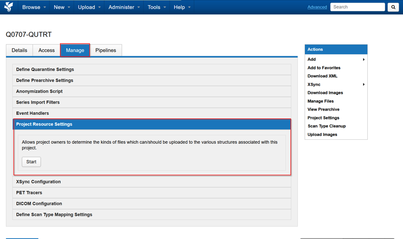
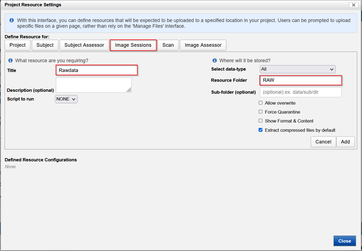
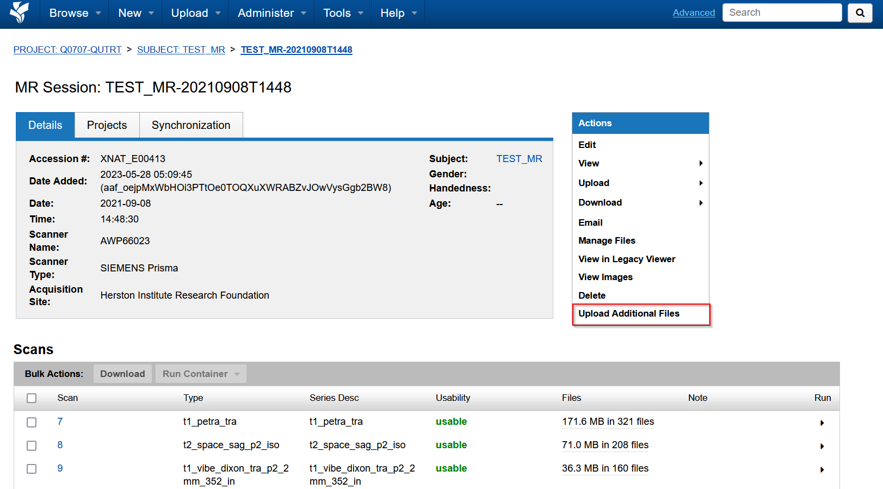

This is to create a web upload form for repeated uploads of any data type.

Navigate to **Project &rarr; Manage &rarr; Project Resource Settings &rarr; Start**

Select **Image Sessions**. Enter the following required fields
- **Title**: e.g. Rawdata
- **Resource Folder**: e.g. RAW
- [x] **Extract compressed files by default**

Select **Add** when complete

To upload file(s) using the resource uploader, **Upload Additional Files** from the Sessions page

