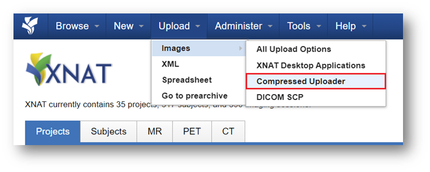
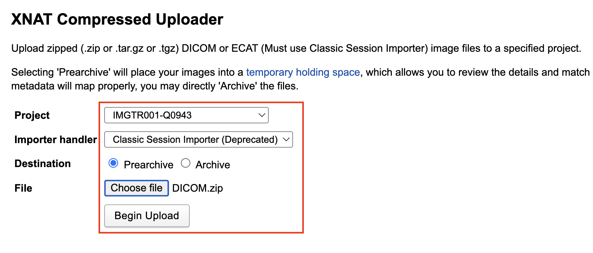
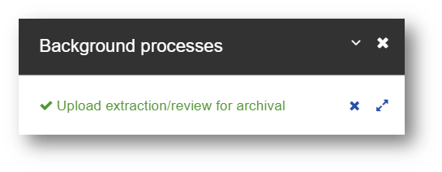
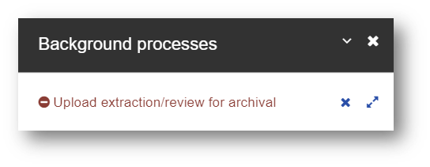

import { Steps } from '@astrojs/starlight/components';

## Uploading DICOM datasets

:::note
This is for uploading **de-identified DICOM** files using the uploader directly from the XNAT website
:::

<Steps>

1. De-identify DICOM on scanner or upload pc

2. Zip DICOM files into a zip file

3. Login to XNAT (see [Login to XNAT](/user-guides/logging-into-xnat))

4. From the top panel, select **Upload &rarr; Images &rarr; Compressed Uploader**

   

5. Specify the following options:

   - **Project**
   - **Destination**: Select **Prearchive**
   - **Choose file** to select zipped file with DICOMs

   

6. Click **Begin Upload**. Wait for:

   - Upload percent bar to finish (percent bar may not appear for small datasets)
   - **Background processes** panel to appear on bottom right
   - Green tick under **Upload extraction/review for archival**

   

   :::caution
   In case of **Background process** errors, expand panel using double arrows on bottom right for more details

   
   :::

</Steps>

For further information refer to the [XNAT official guide on using the compressed image uploader](https://wiki.xnat.org/documentation/how-to-use-xnat/image-session-upload-methods-in-xnat/using-the-compressed-image-uploader).
