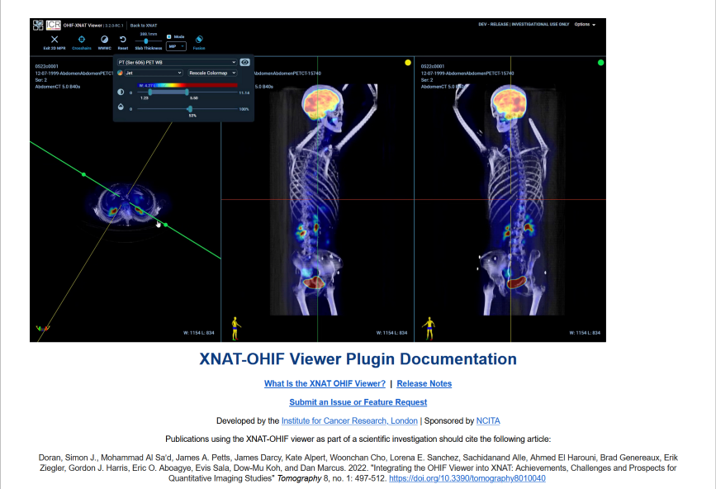
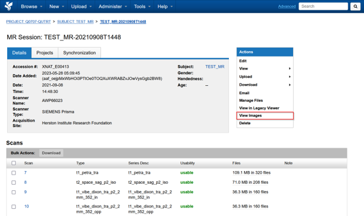
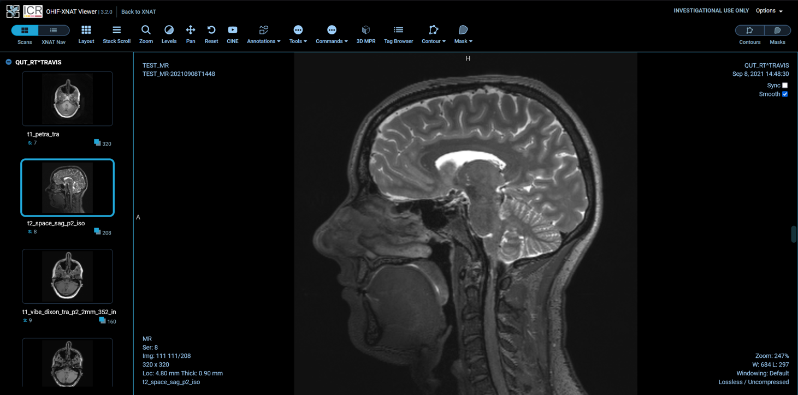

## XNAT OHIF Viewer

AIS XNAT instances come with the XNAT OHIF Image viewer
Which is a plugin developed by the Institute for Cancer Research in London

Just note, if your publication uses the OHIF viewer, they have an article for citation.
This information is all available at the link below

Documentation
: https://wiki.xnat.org/documentation/xnat-ohif-viewer

Using the XNAT OHIF Viewer
: https://wiki.xnat.org/documentation/xnat-ohif-viewer/using-the-xnat-ohif-viewer-122978515.html 

## Opening images in OHIF viewer

You can access the viewer from Session page

Just click **View Image** on the actions panel

:::caution[Note]
Ignore the *View in Legacy Viewer*
:::

This will take you to the OHIF Viewer

