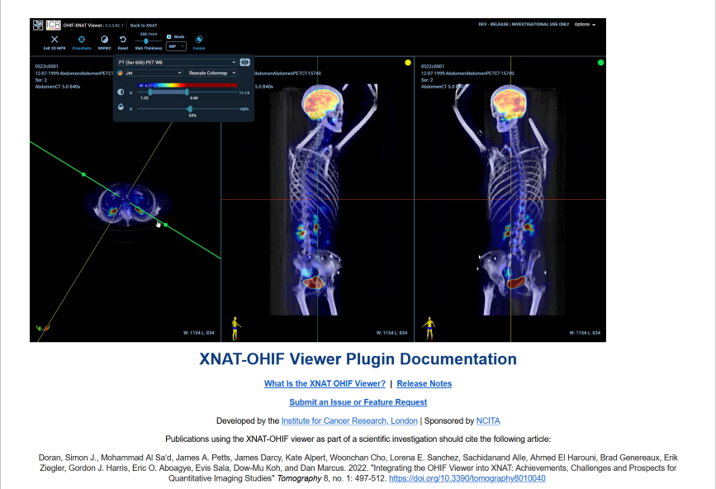
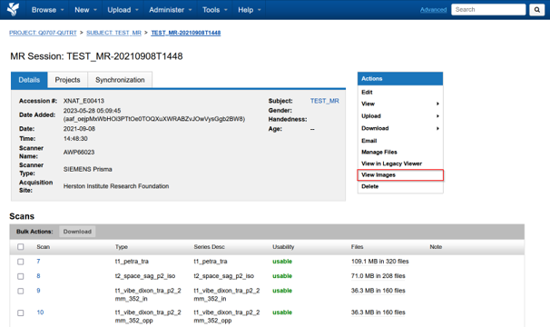
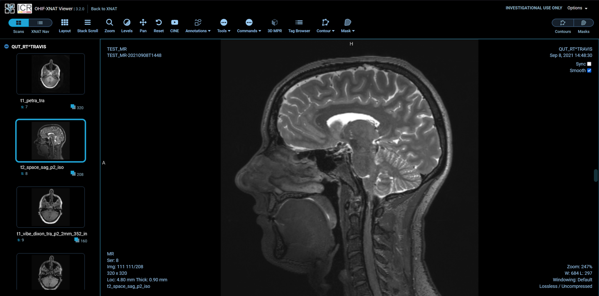

import { CardGrid, LinkCard } from '@astrojs/starlight/components';

## About the XNAT OHIF Viewer

Use the XNAT OHIF Viewer to inspect images in your browser without downloading the DICOM files first.

For viewer controls and citation information, see the official [XNAT OHIF Viewer documentation](https://wiki.xnat.org/documentation/xnat-ohif-viewer) and [guide to using the XNAT OHIF Viewer](https://wiki.xnat.org/documentation/xnat-ohif-viewer/using-the-xnat-ohif-viewer-122978515.html).

## Open a session in the viewer

1. Open the imaging session you want to inspect.
2. Select **View Images** from the actions panel.
3. Wait for the OHIF Viewer to open and load the session.

Use **View Images** rather than **View in Legacy Viewer**.

## Next steps

<CardGrid>
  <LinkCard title="Sessions and scans" href="/user-guides/using-xnat/sessions" description="Inspect session metadata, scans and DICOM headers." />
  <LinkCard title="Download data" href="/user-guides/managing-data/downloading-data" description="Download a project, session or individual scans from XNAT." />
</CardGrid>
