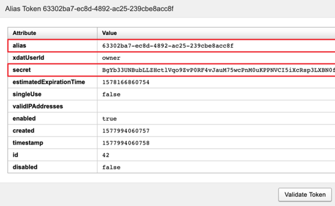
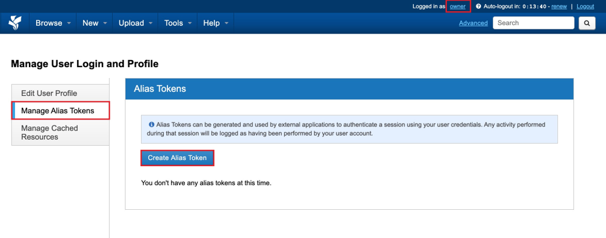
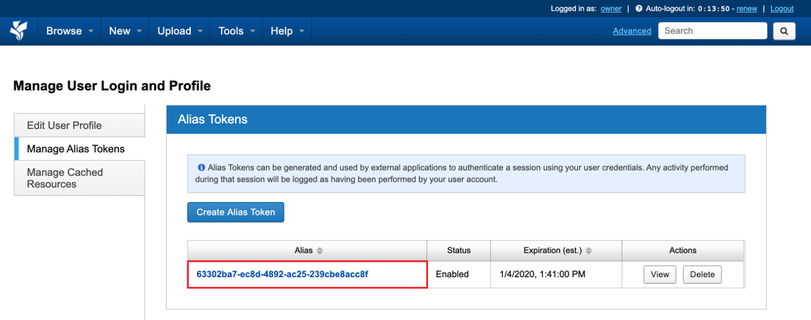
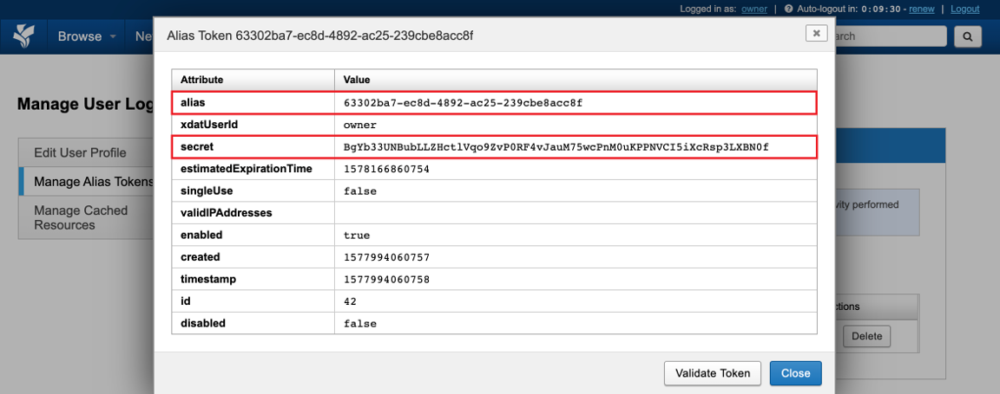

AAF is used for logging into the XNAT website itself.

But there are a lot of tools and services that will require a connect to the XNAT server externally

These could include
- Windows or Mac desktop clients, like XNAT Desktop
- Command line tools such as xnatpy, pyxnat, xnatutils etc
- XSYNC

All of these tools and services need a way to authenticating to your XNAT account without AAF.

An alias token is a time-limited, long, randomised username and password used for authenticating from external services, without compromising your AAF account or credentials. They can be generated and revoked easily

We’ll look at how to generate them next

## Generating Alias tokens

To access the alias token
Click your name on the top right of the website. 
This will take you to your user profile management page

Then click the “Manage Alias Tokens” option

There, you’ll find the option to “Create an Alias Token”

When you create the alias token, it will appear as a new entry

Alias tokens expire 60 days after creation
There will be an expiration date column. 

You can have multiple alias tokens. And they can be deleted and created as needed to revoke permissions.
Each one will be randomised and unique.

Lets have a look at the alias token details which you can access by clicking on the token.

The key attributes that we need are the alias and the secret
The alias is your username
And secret is your password

So you can use the alias and secret for any external clients requesting a username and password.

Just note, the alias and secret are effectively a temporary set of login credentials.
Do not reveal the secret. It is effectively your temporary password.
If you no longer require the alias token, or suspect a secret has been compromised, just delete the alias token.

