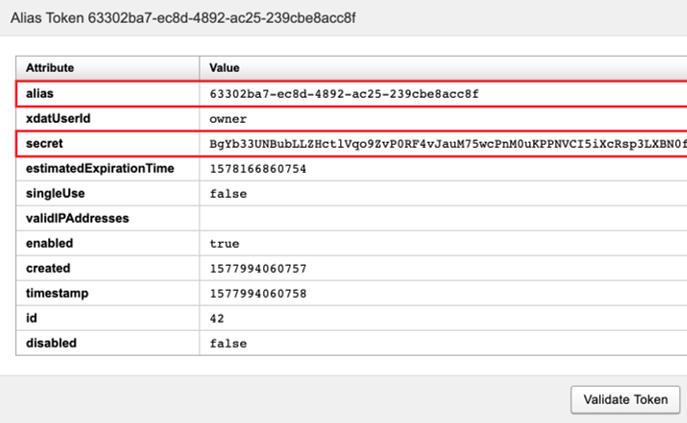
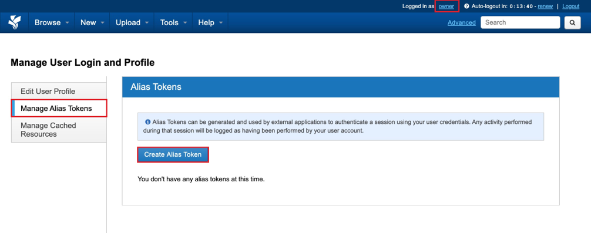
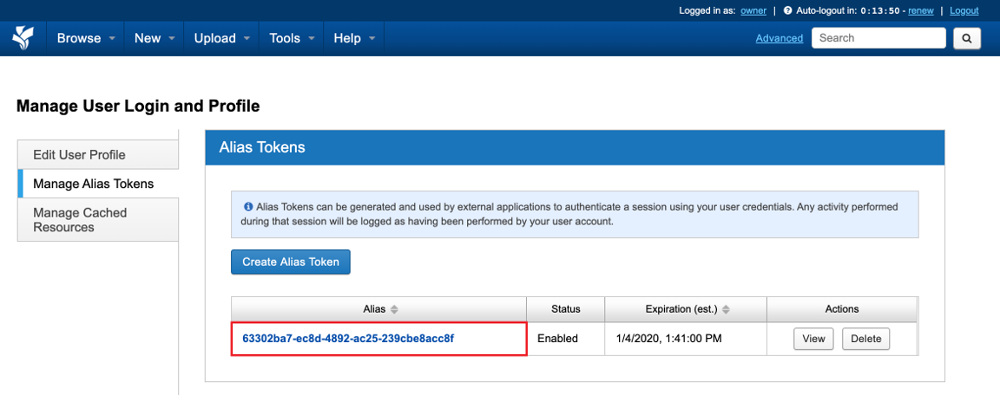
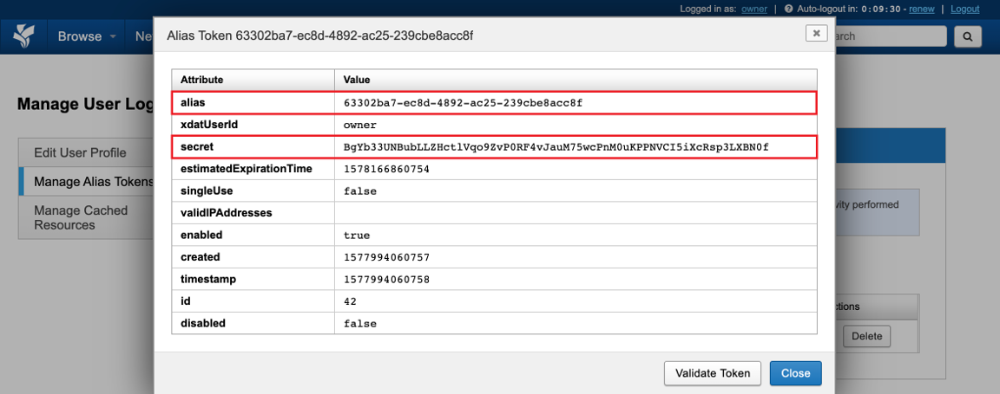

import { CardGrid, LinkCard, Steps } from '@astrojs/starlight/components';

Use your Australian Access Federation (AAF) account to log in to the XNAT website. For an external application, generate an alias token instead of entering your AAF credentials.

An alias token is a temporary, randomised username and password pair associated with your XNAT account. Actions performed with the token are recorded as actions by your account. You can create separate tokens for desktop clients, command line tools and XSync, then revoke each token independently.

## Generate an alias token

<Steps>

1. Log in to XNAT and select your username in the top-right corner to open your profile.

   

2. Select **Manage Alias Tokens**, then select **Create Alias Token**.

   

3. Find the new token in the table. Check its status and expiry date before using it.

   

4. Select **View** to display the token details. Copy the `alias` and `secret` values to the application that needs them.

   

</Steps>

## Use the token

When an external application asks for XNAT credentials, use:

- `alias` as the username
- `secret` as the password

Treat both values as credentials. Do not share the secret, include it in screenshots or commit it to a repository. Create a replacement token when the current token approaches the expiry date shown in XNAT.

## Revoke a token

Return to **Manage Alias Tokens** and select **Delete** beside a token when you no longer need it. Delete it immediately if its secret may have been exposed. Applications using that token will no longer be able to connect.

## Next steps

<CardGrid>
  <LinkCard title="Command line tools" href="/user-guides/processing-data/command-line-tools" description="Use an alias token with xnatutils, xnatpy or pyxnat." />
  <LinkCard title="XNAT Desktop client" href="/user-guides/managing-data/downloading-data/?method=desktop-client" description="Download larger datasets with resumable transfers." />
  <LinkCard title="Syncing between XNATs" href="/user-guides/managing-data/syncing-data" description="Use an alias token to authenticate XSync to a destination XNAT." />
</CardGrid>
