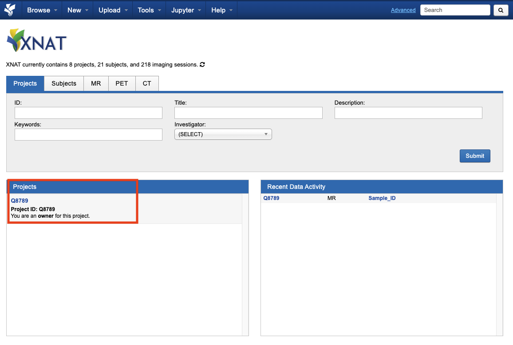
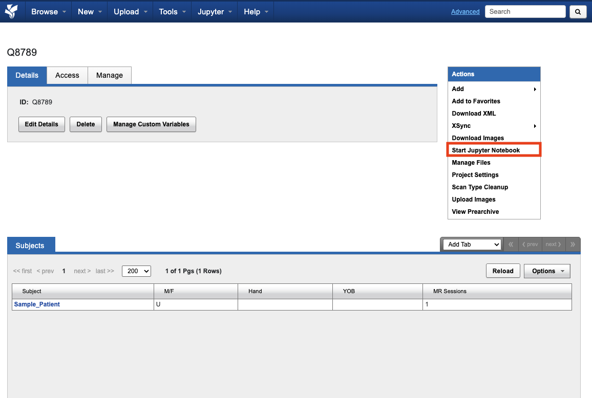
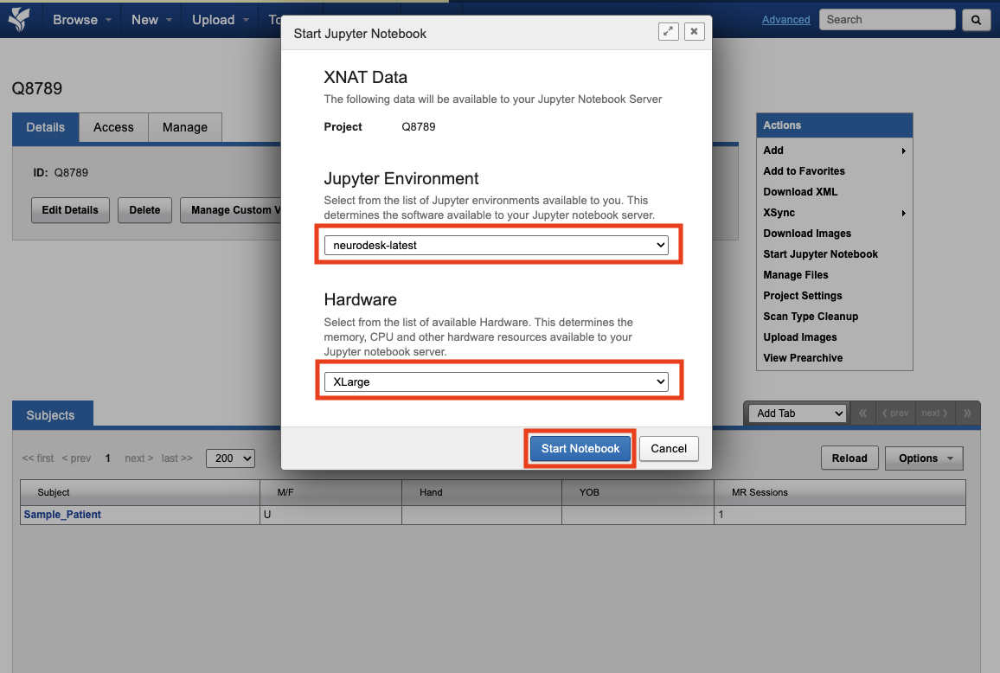
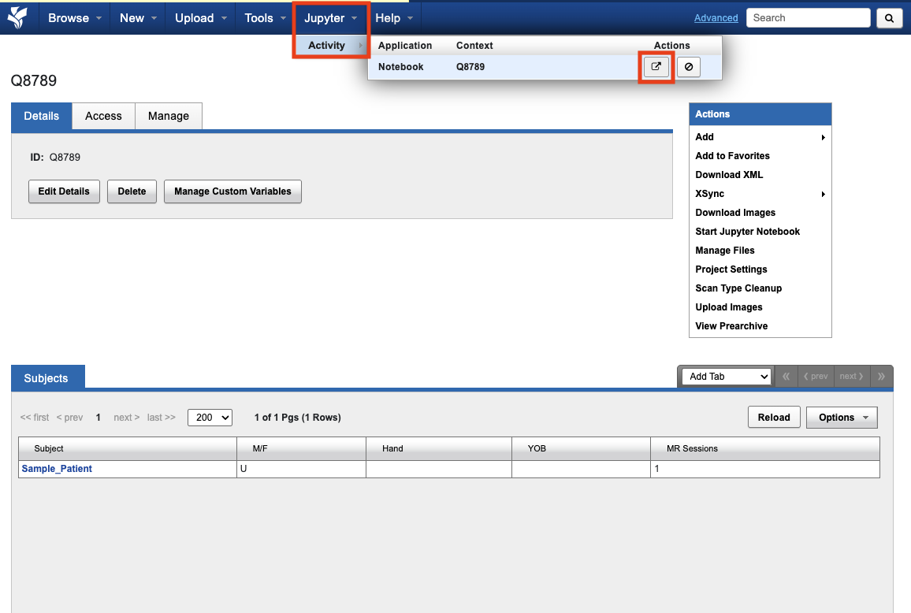

You can access a Jupyter environment directly from XNAT. This allows you to run analysis on your data using familiar tools like Jupyter notebooks.

## Start an interactive session

Select a project



Start Jupyter



Select settings



Open jupyter window



## Using interactive session

The project data will be accessible as read-only at:
```
/data/projects
```
