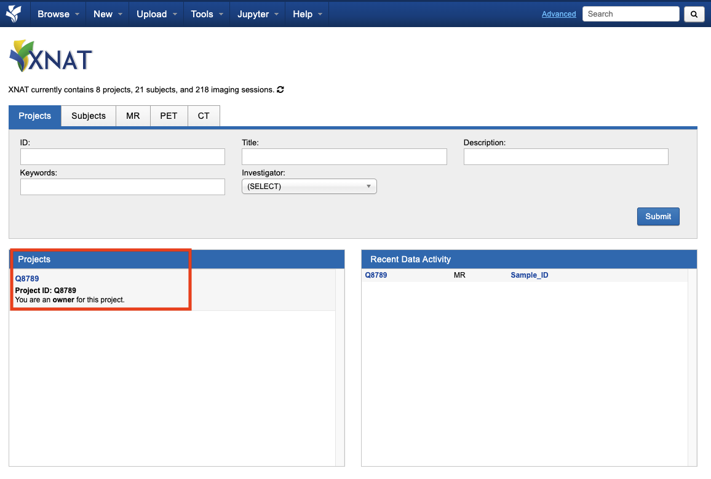
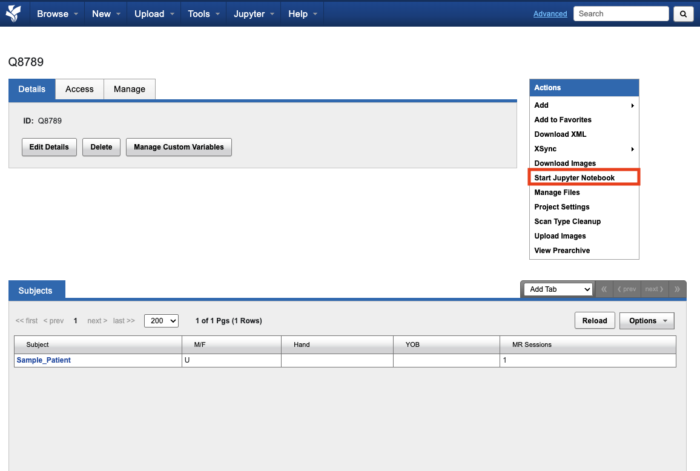
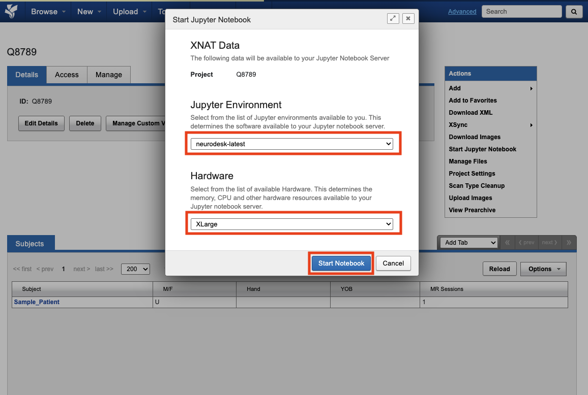
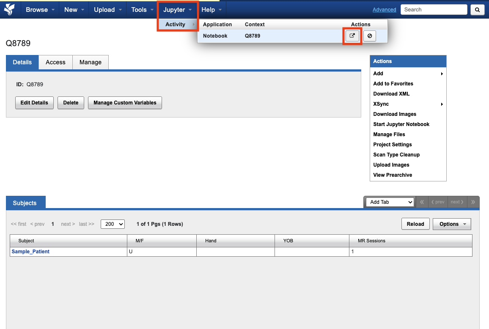

import { Tabs, TabItem, Steps } from '@astrojs/starlight/components';
import RequestEmailForm from '@components/RequestEmailForm.astro';

You can access a Jupyter environment directly from XNAT. This allows you to run analysis on your data using familiar tools like Jupyter notebooks. RCC support can set up access to the Jupyter environment.

## Request access to the Jupyter environment

<Steps>

1. Open a ticket with RCC support. Fill in the XNAT projects that should be accessible from the Jupyter environment, then copy the generated email into your mail client.

   <RequestEmailForm
     fields={[{ id: 'projects', label: 'XNAT Projects', placeholder: 'e.g. Q1111, Q2222' }]}
     subject="Request Jupyter environment access to XNAT project data for {projects}"
     body={"Hello RCC support,\n\nCould you please enable Jupyter environment access to XNAT project data for {projects}?\n\nThank you"}
   />

2. The support ticket will inform you when your access is set up. Jupyter access setup typically takes around ~24 hours from ticket submission.

</Steps>

## Start an interactive session

Select a project



Start Jupyter



Select settings



Open jupyter window



## Using interactive session

The project data will be accessible as read-only at:
```
/data/projects
```
