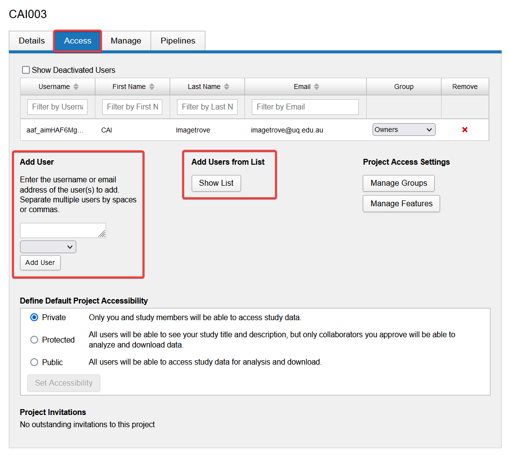

Switch to the Access tab. Use **Add User** or **Add Users from List** to select the user to add

Select role from
1. Owners
2. Members
3. Collaborators

## User roles

The following table outlines the permissions given to each role.

| Permission           | Owners  | Members | Collaborators |
|----------------------|---------|---------|---------------|
| Data - Create        | &check; | &check; | &cross;       |
| Data - Read/Download | &check; | &check; | &check;       |
| Data - Update        | &check; | &check; | &cross;       |
| Data - Delete        | &check; | &cross; | &cross;       |
| User - Add/Remove    | &check; | &cross; | &cross;       |
| User - Change role   | &check; | &cross; | &cross;       |
