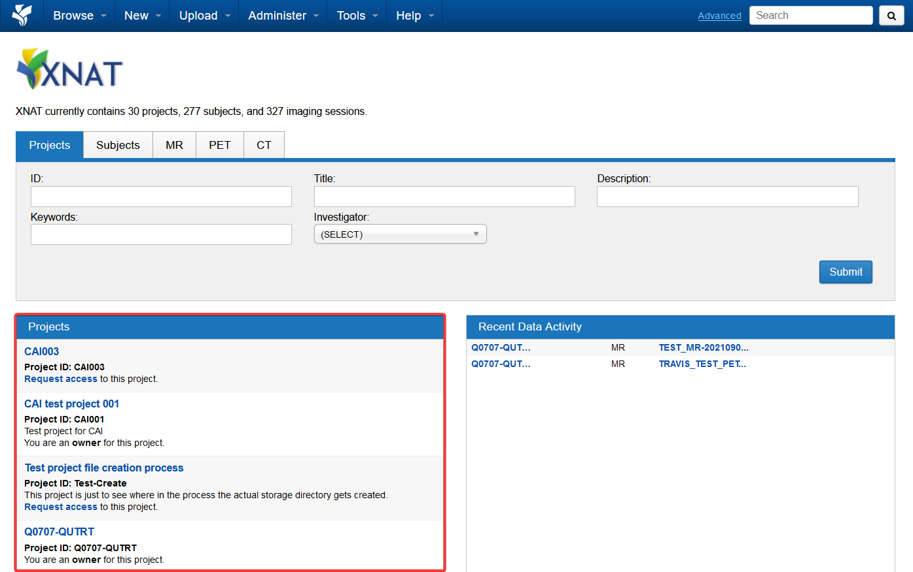

When you login into the home page, the list of projects that you have access to will be on the left

- All datasets have to go into Projects
- User access is controlled at the project level

## Working with projects

- [Your XNAT project](/user-guides/using-xnat/projects/your-project) — request a new project, or get access to an existing one
- [Granting access](/user-guides/using-xnat/projects/granting-access) — add users as Owners, Members or Collaborators
- [Requesting more storage](/user-guides/using-xnat/projects/request-storage) — raise the 1TB and 1 million file limits
