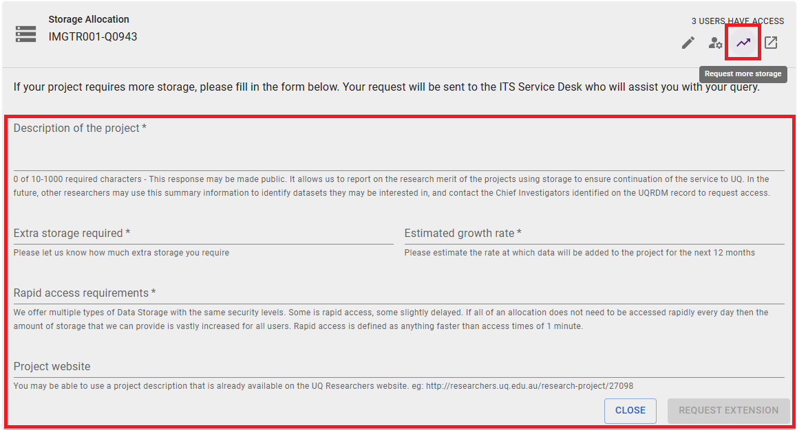

import { Card, Steps } from '@astrojs/starlight/components';

:::caution[Note]
Default limits on collections are **1TB storage** and **1 million files**. 
If either limit is reached, you may not be able to add or update files.
:::

Use the following steps to request an increase in storage size and/or file count limit:

<Steps>

1. Go to [rdm.uq.edu.au](https://rdm.uq.edu.au), login and select your RDM collection

2. Click the **Request more storage** button (shown below)

   

3. Fill the form with the relevant details and submit.

   E.g. For a project with 2 years of data acquisition, collecting a total of 1TB and 1 million files, the request form could look like this:

   <Card title="Description of the project">
   ...
   </Card>
   <Card title="Extra storage required">
   Increase storage space by 1TB. 
   Increase file count limit by 1M files. 
    
   Collection is connected to UQ XNAT so cannot zip/tar files
   </Card>
   <Card title="Estimated growth rate">
   0.5TB per year 
   0.5M files per year 
   </Card>
   <Card title="Rapid access requirements">
   ...
   </Card>

</Steps>
