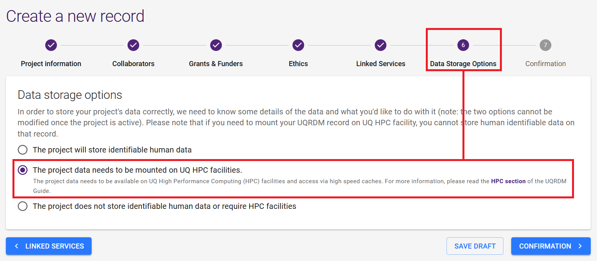

import { Tabs, TabItem, Steps } from '@astrojs/starlight/components';
import ChoiceCards from '@components/ChoiceCards.astro';
import RequestEmailForm from '@components/RequestEmailForm.astro';
import TabQueryLink from '@components/TabQueryLink.astro';

Every dataset in XNAT lives in a project, and access is controlled per project.
When you first log in you will have no projects listed.

<ChoiceCards
  label="Choose whether the project already exists"
  options={[
    { tab: 'A new project', who: 'Your study does not have an XNAT project yet' },
    { tab: 'An existing project', who: 'The project exists and you need access to it' },
  ]}
/>

<Tabs syncKey="project-route">

<TabItem label="A new project">

Only UQ staff and students can request a new project, because each XNAT project
is allocated against a UQ-RDM HPC collection. If you are not at UQ, ask a UQ
collaborator to request it.

:::note
If your data is acquired at HIRF, CAI or TRI, check with the facility first —
they may create the project for you as part of your imaging booking.
:::

<Steps>

1. Create a UQ-RDM **HPC Collection**.

   Open [https://rdm.uq.edu.au/create-record](https://rdm.uq.edu.au/create-record),
   log in, and fill in the record with your project details.

   

   :::caution[Important]
   For **(6) Data Storage Options**, select the second option (_The project data
   needs to be mounted on UQ HPC facilities._). Any other option is incompatible
   with XNAT and will require a new RDM request.
   :::

   Select **REQUEST DATA STORAGE**. You will end up with a collection name such
   as **PROJ001-Q0189** — HPC collections end in **-Q**, not **-A** or **-I**.

2. Send the request to RCC support.

   <RequestEmailForm
     fields={[
       { id: 'collection', label: 'RDM Collection Name', placeholder: 'e.g. PROJ001-Q0189' },
     ]}
     subject="Request new XNAT project for {collection}"
     body={"Hello RCC support,\n\nCould you please create a new XNAT project for RDM collection {collection}?\n\nThank you"}
   />

3. Wait for confirmation. Project setup typically takes around 24 hours.

</Steps>

</TabItem>

<TabItem label="An existing project">

Access is granted per project by an Owner, so someone has to add you.

<Steps>

1. Ask the person who owns the project to add you.

   - **A study run by a colleague** — ask the study lead.
   - **Data acquired at HIRF, CAI or TRI** — ask the facility, if they set the
     project up.

2. They follow [Granting access](/user-guides/using-xnat/projects/granting-access)
   and choose your role — Owner, Member or Collaborator.

3. Log in to XNAT. The project appears in your project list.

</Steps>

:::caution
Contact RCC support if you have been told access was granted but the project is
still missing after five working days.
:::

:::note
If you are from a non-AAF organisation, request an AAF account first — see
[Signing up](/user-guides/getting-started/?member=non-aaf-members).
:::

</TabItem>

</Tabs>

<TabQueryLink param="route" />

## Further reading

- [Granting access to your project](/user-guides/using-xnat/projects/granting-access)
- [Requesting more storage](/user-guides/using-xnat/projects/request-storage)
