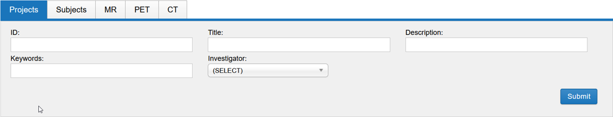
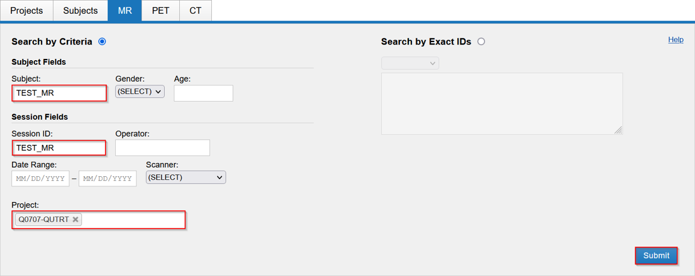
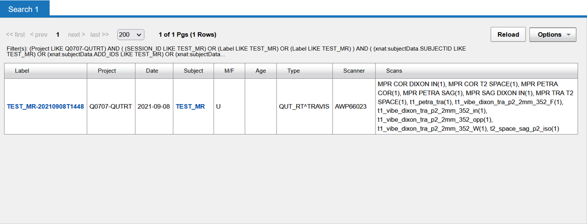

You can search across Projects, Subjects or Sessions
And Sessions are broken up into MR, PET and CT

For instance, we can fill a couple of fields on the MR Sessions search
You don’t have to specify all the fields

And XNAT will provide a list of results.

