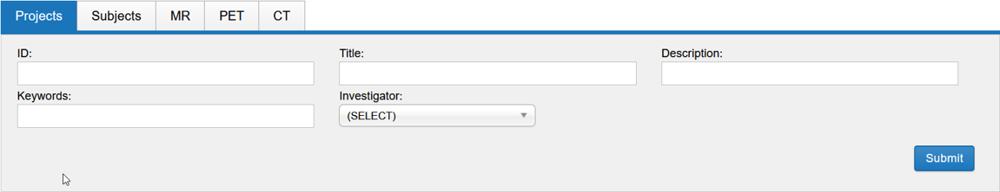
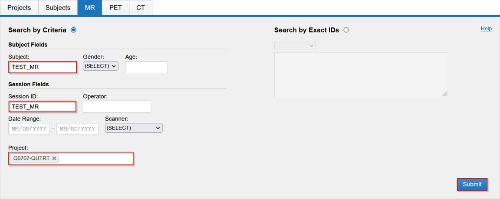
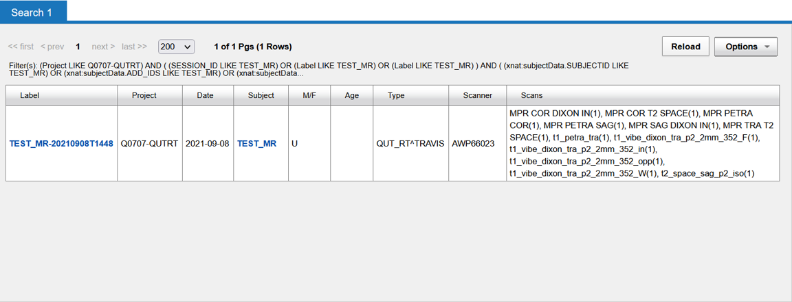

import { CardGrid, LinkCard } from '@astrojs/starlight/components';

Use XNAT search to find projects, subjects or imaging sessions that match known metadata or identifiers.

## Choose what to search

Open **Advanced** search, then select a data type. You can search **Projects**, **Subjects**, **MR**, **PET** or **CT**. The available fields change with the selected data type.

## Search by criteria

Select **Search by Criteria**, then enter one or more values in the form. You do not need to complete every field. For example, an MR search can combine a project, subject, session ID, date range, scanner or subject metadata.

Select **Submit** to run the search.

## Search by exact IDs

Select **Search by Exact IDs** when you already know the identifiers you need. Enter the identifiers in the field provided, then select **Submit**.

Switch back to **Search by Criteria** when you need to find records from partial metadata instead.

## Review the results

The results table shows matching records and their project, subject, date, modality and scanner details. Select a linked label or subject to open that record. Use **Options** to work with the result set, or **Reload** after changing the search.

## Next steps

<CardGrid>
  <LinkCard title="Subjects" href="/user-guides/using-xnat/subjects" description="Review subject metadata and subject-level actions." />
  <LinkCard title="Sessions and scans" href="/user-guides/using-xnat/sessions" description="Inspect imaging sessions, scans and DICOM headers." />
</CardGrid>
