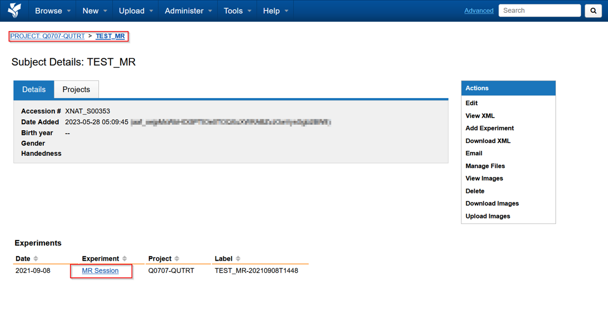
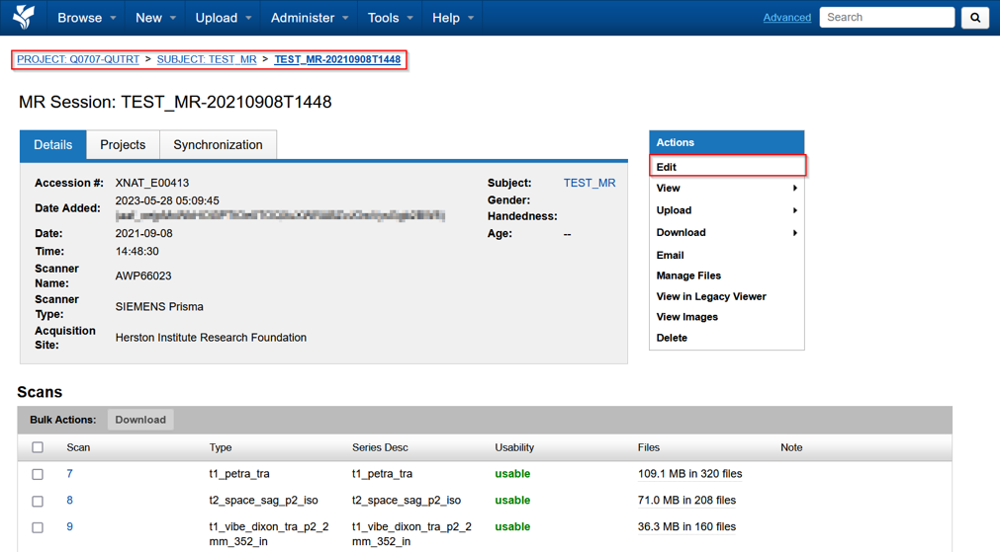
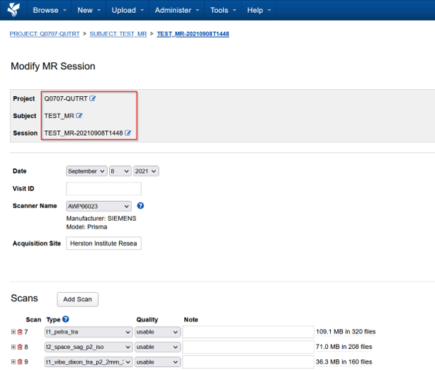
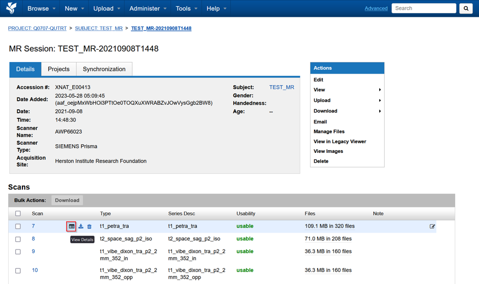
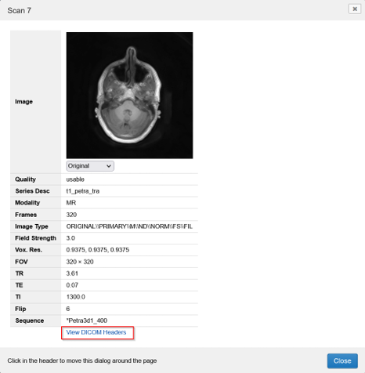
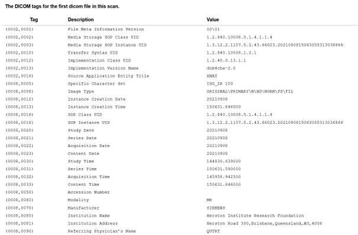

Sessions are divided into three types, based on modality information extracted from the DICOM metadata
- MR
- CT
- PET

The following is an example MR session

## Editing Sessions
We can edit session details and metadata from the actions panel on the right

Here we can change some of the key properties of the sessions, such as
- Change session name
- Move sessions to other projects
- Move sessions to other subjects
- Create a new subject, and move session to that subject
- Fix invalid or blank session names

## Viewing scans

The Scans themselves are listed at the bottom with the relevant series descriptions and other information
If you hover over one of them, and click the highlighted view details button. This will open up a more details and an image preview window

Here we can also view View DICOM headers

And see the DICOM headers as shown on the right

