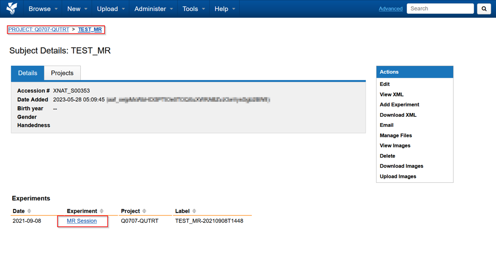
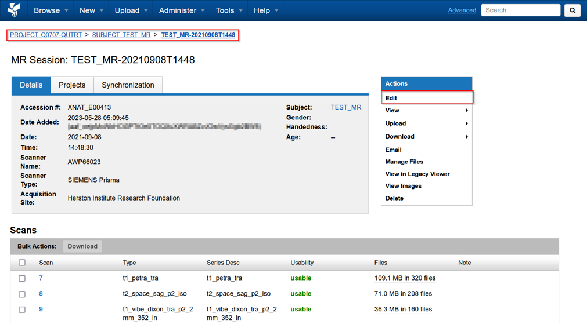
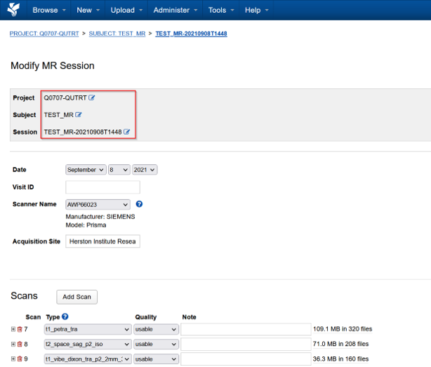
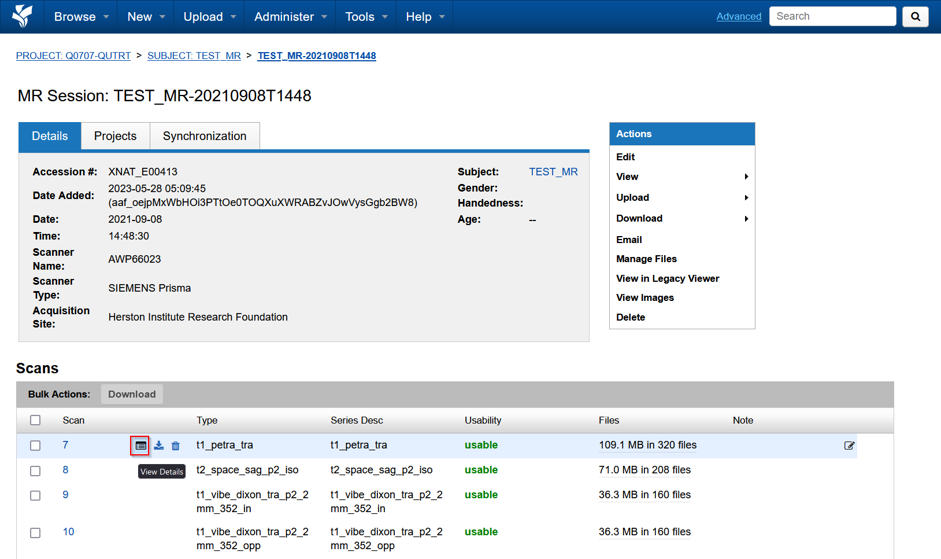
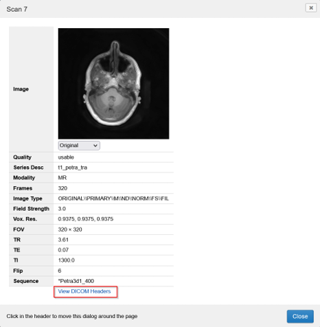
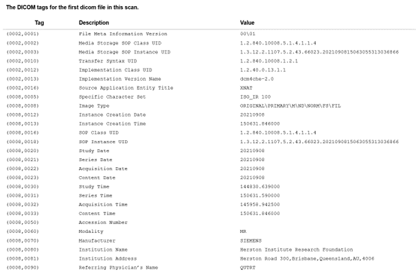

import { CardGrid, LinkCard } from '@astrojs/starlight/components';

XNAT organises imaging sessions by the modality recorded in their DICOM metadata, such as MR, CT or PET. Open a session to review its metadata, scans and files.

## Edit a session

Use the actions panel on the right of the session page to edit session details and metadata.

The available actions let you:

- change the session label
- move the session to another project
- move the session to another subject
- create a subject and move the session to it
- correct an invalid or blank session label

## Inspect scans

The **Scans** table lists the scans in the session, including their series descriptions. Point to a scan and select its view-details button to open its details and image preview.

## View DICOM headers

Select **View DICOM headers** from the scan details to display the header values in the panel on the right.

## Next steps

<CardGrid>
  <LinkCard title="View images" href="/user-guides/managing-data/viewing-images" description="Open an imaging session in the browser-based OHIF Viewer." />
  <LinkCard title="Download data" href="/user-guides/managing-data/downloading-data" description="Download a session or individual scans from XNAT." />
</CardGrid>
