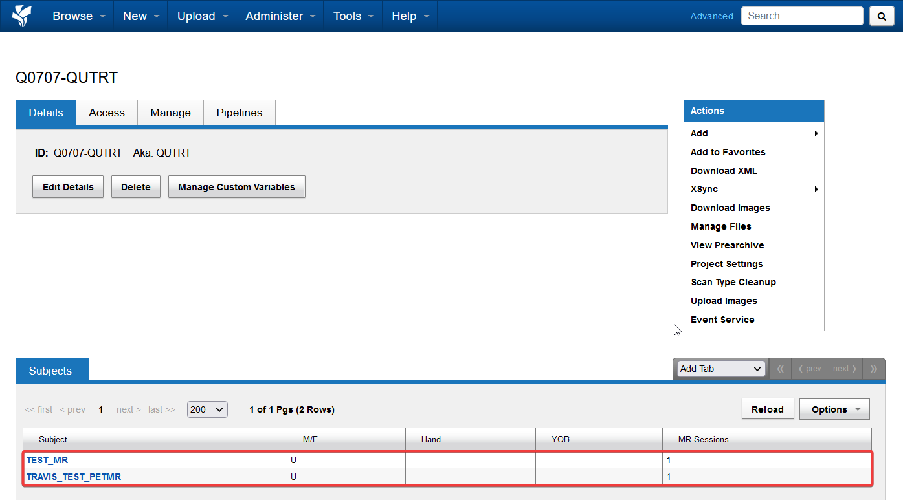
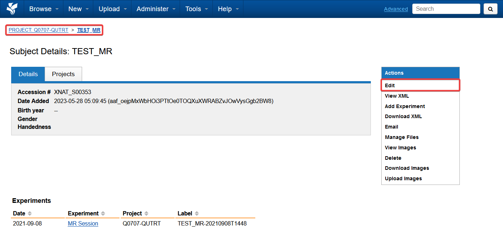
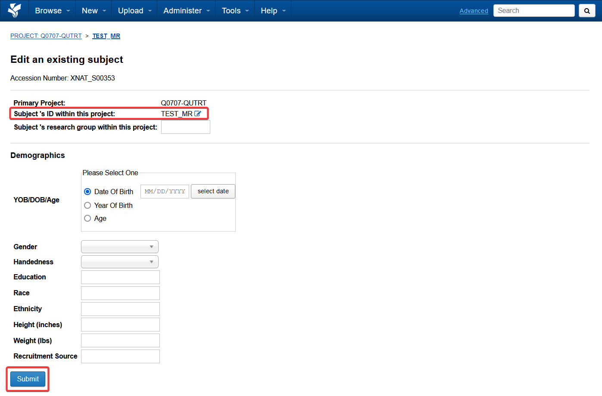
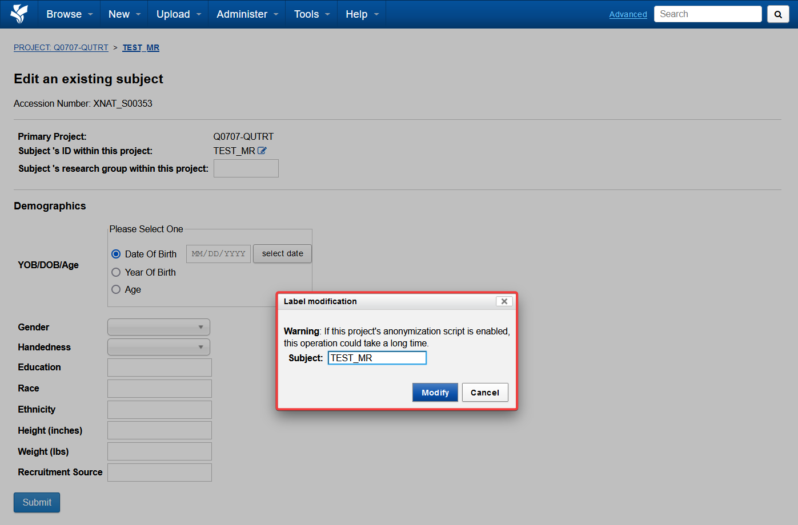

The Project page will have a list of Subjects
If we click one of the subjects… it will take us to the subject page

The Subject will have some associated metadata and name extracted from the DICOM headers of the datasets

## Editing Subjects

We can edit subject details and metadata from the actions panel on the right

For instance, if you want to rename the subject
You click the button next to the Subject ID

This will pop-up the following dialog box for you enter the new subject.
Click modify, and then submit for the changes to take effect.

Just note, subject renaming can take a few minutes to take effect

