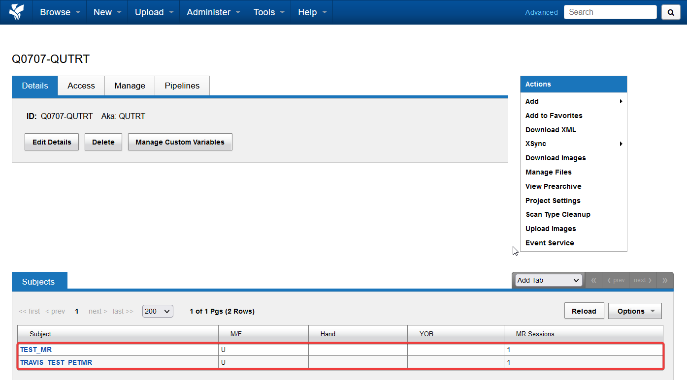
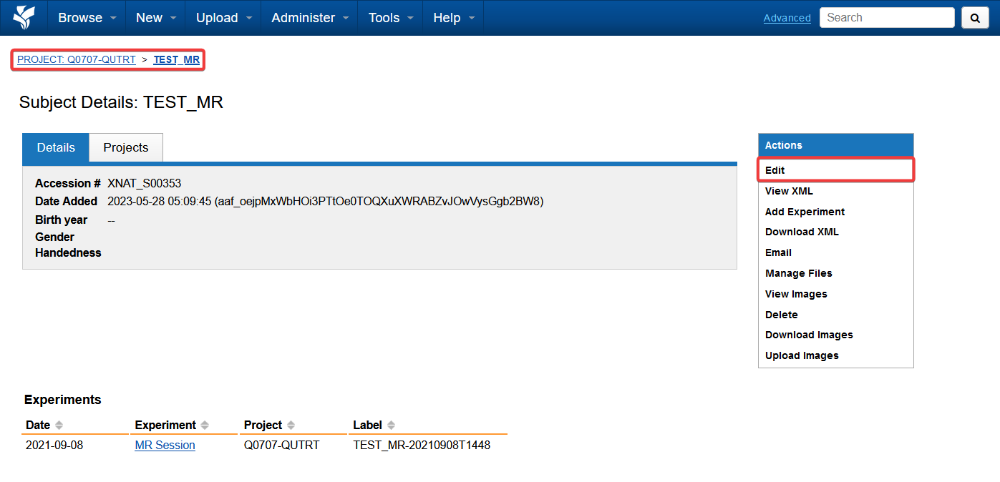
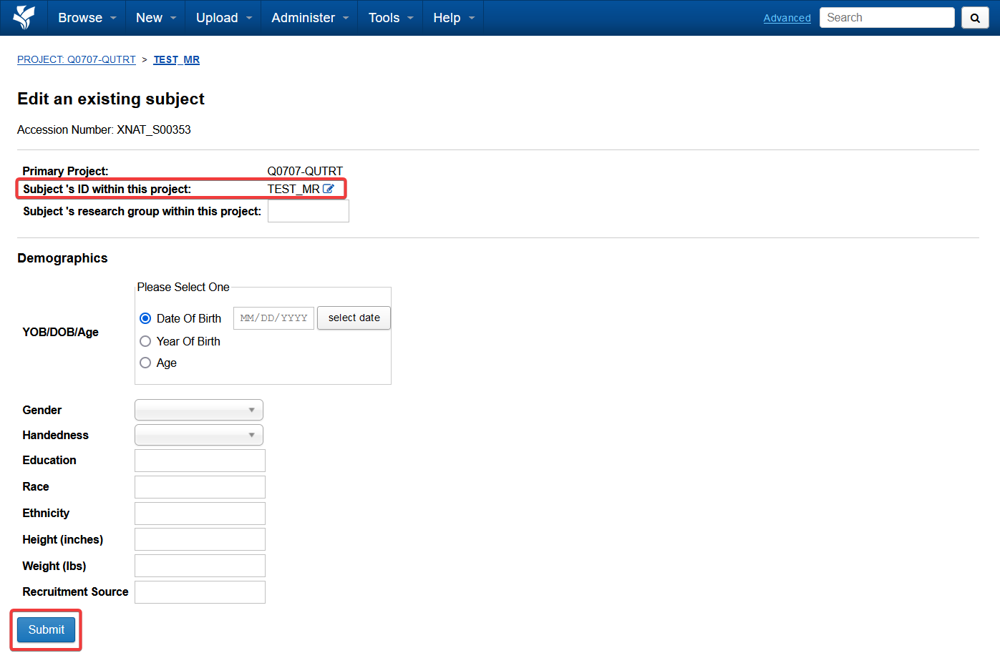
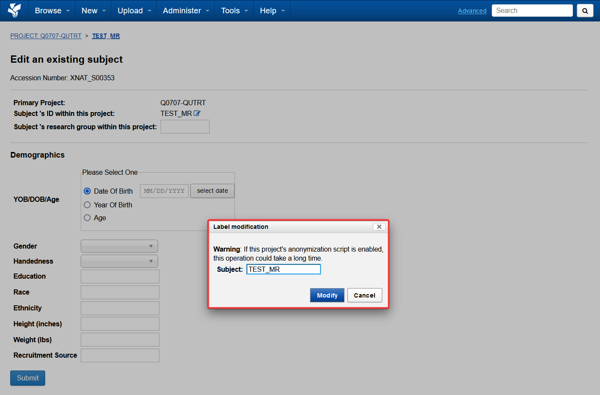

import { CardGrid, LinkCard } from '@astrojs/starlight/components';

## Open a subject

Open a project to see its subjects. Select a subject from the list to open its page and review the associated imaging sessions and metadata extracted from the DICOM files.

## Edit subject details

Use the actions panel on the right of the subject page to edit its details and metadata.

## Rename a subject

1. Select the edit button beside **Subject ID**.
2. Enter the new subject ID in the dialog.
3. Select **Modify**, then submit the change.

Renaming may take a few minutes because XNAT updates the subject and its associated data.

## Next steps

<CardGrid>
  <LinkCard title="Sessions and scans" href="/user-guides/using-xnat/sessions" description="Open a subject's imaging sessions, inspect scans and edit session metadata." />
</CardGrid>
