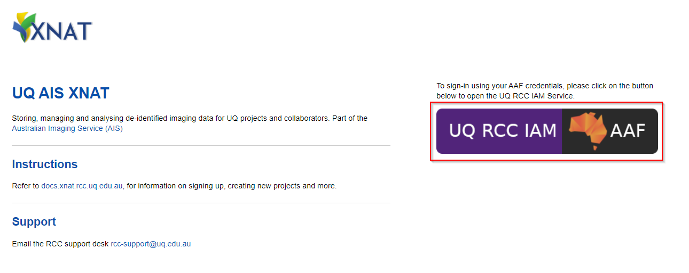
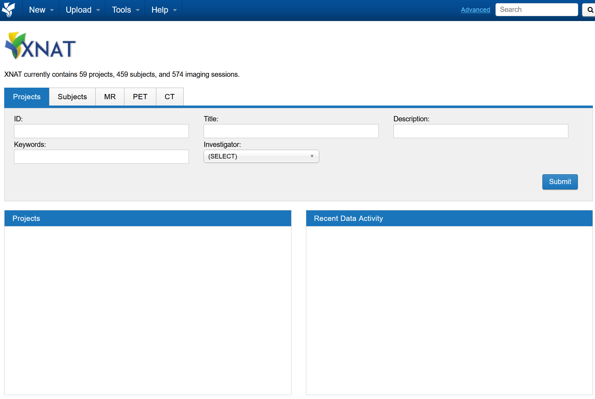

import { Steps } from '@astrojs/starlight/components';

<Steps>

1. Open [https://xnat.rcc.uq.edu.au](https://xnat.rcc.uq.edu.au)

   :::caution[Note]
   This is the link to the UQ AIS XNAT. If you have been provided with a project specific XNAT link to use, use that one instead
   :::

2. Log in with the AAF Single sign-on button (shown below).

   Follow the AAF login process for your organisation

   

3. After the AAF sign-in, you should be redirected back to XNAT.

   There will be **no projects listed** when signing in for the first-time, as your user account would have just been created.

   

</Steps>
